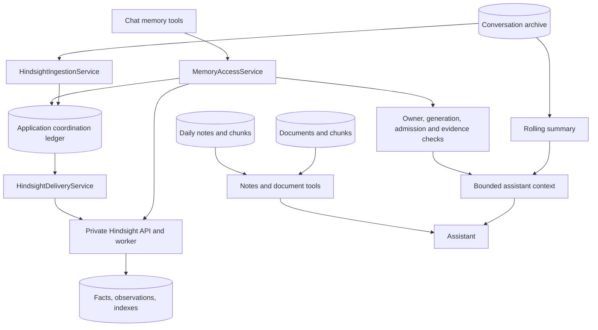

# Sydia — Memory Systems

| Field  | Value                                                                         |
| ------ | ----------------------------------------------------------------------------- |
| Date   | 1 October 2026                                                                |
| Scope  | Backend memory, conversation context, notes/documents, and debug UI           |
| Status | Local Hindsight cutover complete; legacy implementation retained for rollback |

Hindsight owns long-term fact extraction, consolidation, embeddings, observations, and recall. Sydia owns authenticated user-bank selection, evidence admission, delivery coordination, corrections, forgetting, and assistant integration. Conversation history, rolling summaries, daily notes, and document retrieval remain separate systems.

The [migration plan](./memory_systems_migration_hindsight.md) records implementation phases. The [operations runbook](./hindsight_operations.md) covers deployment, delivery recovery, backfill, export, rollback, and backup/restore.

## 1. Deployment and engine selection

The local API and worker use `BACKEND_MEMORY_ENGINE=hindsight`, with automatic recall and ingestion enabled for all users. The private Hindsight API runs on loopback port 8889 with its own persistent PostgreSQL database. The application database remains on port 55432. Remote production settings were not changed by this cutover.

`MemoryEngineService` resolves the engine server-side:

| Mode        | Reads and explicit chat mutations | Automatic writer                                       |
| ----------- | --------------------------------- | ------------------------------------------------------ |
| `legacy`    | Existing local memory service     | Legacy dreaming                                        |
| `shadow`    | Existing local memory service     | Legacy dreaming plus isolated Hindsight ingestion      |
| `hindsight` | Hindsight adapter                 | Hindsight ingestion; legacy dreaming skips these users |

`BACKEND_HINDSIGHT_COHORT` limits the configured mode to listed internal user IDs; users outside that set stay on legacy. An empty cohort means all users receive the configured mode. New installations default to legacy with ingestion and automatic recall disabled until Hindsight is configured.

Banks are derived from an environment namespace and a hash of the authenticated user ID. Shadow banks use a separate namespace and checkpoint. A shared private API key authenticates Sydia to Hindsight; it does not replace owner authorization in Sydia.

The frontend `/memory` page and navigation entry require `VITE_DEBUG_ENABLED === "true"`. Editing, pinning, revision badges, and provenance displays there are debugging controls. In Hindsight mode, the old `/memories` REST endpoints return HTTP 409 instead of exposing stale legacy state. Chat memory tools provide the active integration; no public memory-management page was added.

## 2. Stores and boundaries

| System                         | Storage / authority                                    | Purpose                                                                                  |
| ------------------------------ | ------------------------------------------------------ | ---------------------------------------------------------------------------------------- |
| Durable facts and observations | Hindsight PostgreSQL                                   | Long-term preferences, facts, decisions, routines, and evidence-backed derived recall    |
| Memory coordination            | Application `hindsight_*` tables                       | Ownership, source generations, retries, admission, suppression, checkpoints, and erasure |
| Conversation archive           | Application conversations/messages                     | Original history and user evidence                                                       |
| Rolling summaries              | `conversation.rollingSummary`, `conversation_summary`  | Continuity within the context budget                                                     |
| Daily notes                    | `daily_note`, `daily_note_chunk`                       | Owner-local dated journal and independent retrieval index                                |
| Documents                      | `file_asset`, `document`, `document_chunk`             | Uploaded content and file RAG                                                            |
| Legacy memory                  | `memory`, `memory_dream_run`, `memory_deletion_marker` | Other configured cohorts and rollback support                                            |

The local ledger is not a duplicate extracted-fact cache:

| Table                   | Responsibility                                                                                                                      |
| ----------------------- | ----------------------------------------------------------------------------------------------------------------------------------- |
| `hindsight_bank`        | Owner/namespace, active or erasing/erased state, leases, retry metadata, durable account-erasure intent                             |
| `hindsight_source`      | Logical source identity, kind, generation, original event time, user-message evidence, and legacy import mapping                    |
| `hindsight_delivery`    | Generation-specific document/operation IDs, reviewed replay input, request identity, checksum, and delivery/admission/erasure state |
| `hindsight_reference`   | Mapping from admitted remote fact IDs to a delivery; no duplicate fact text                                                         |
| `hindsight_suppression` | Forgotten message evidence excluded from re-extraction and retrieval                                                                |
| `hindsight_checkpoint`  | Independent namespace/policy/conversation progress and pending source completion                                                    |
| `hindsight_rollback`    | Reconciliation boundary, counts, and audit without fact content                                                                     |

Bank records deliberately survive local account deletion until remote erasure completes. Delivery replay content is cleared when its source is withdrawn. Original explicit input may be retained while active because retries and corrections need it.

## 3. Remember, correct, and forget

`DomainToolsProvider` routes `save_memory`, `update_memory`, `forget_memory`, and `search_memories` through `MemoryAccessService`.

A save validates owned user evidence from up to eight user messages in the same conversation through the requesting turn (8,000 characters total), so follow-up requests can refer to an earlier fact. Assistant text, credentials, later turns, and forgotten evidence are excluded; only quoted fact/permission messages and the requesting turn become source attribution. A save excludes credentials, reviews durable/sensitive claims through `MemoryPolicyService`, and commits a source/delivery intent before publishing a BullMQ job. A successful tool call can mean **queued**, not remotely retained or admitted. Memory mutations continue through the model for a conversational reply; queue and storage progress stay internal. Ordinary personal statements rely on automatic extraction rather than an explicit save tool. Explicit remember/correct/forget requests are acknowledged naturally, without claiming pending retention or permanent erasure is complete.

Delivery follows these stages:

1. `pending`: source intent committed locally.
2. `submitted`: retention accepted with a durable operation ID.
3. `retained`: operation completion verified and extracted facts available.
4. `admitted`: fact evidence reviewed and owner, generation, suppression, opt-out, and lease checks revalidated.

Only admitted current generations are retrievable. Invalid extraction is withdrawn and erased; transient failures preserve durable work for retry. Fact review is bounded to 200 facts per source and four facts per model call, with lease renewal between batches and before final admission. Partial batches never become independently readable.

Chat receives opaque `hm:` fact/evidence references or `hs:` source-generation references. Observations resolve to supporting admitted facts; they are not separately editable facts. A targeted correction preserves unrelated admitted facts, withdraws the old generation, and sends a replacement. Stale references cannot silently overwrite a newer generation.

Forgetting immediately suppresses connected source-message evidence across generations, shadow/active banks, and associated legacy copies. It clears replay input and queues document erasure. The worker waits for known retention to finish, deletes the document, verifies absence of raw facts, and periodically rechecks erased generations for uncertain late writes. Unrelated sources remain available.

Account deletion transactionally retires banks and schedules durable erasure alongside local user deletion. Recovery continues after the user row disappears; stale jobs cannot recreate an erased bank. Completed bank erasure is rechecked hourly.

## 4. Automatic ingestion and recovery

The existing idle scheduler remains the conversation trigger. After a completed assistant run, it debounces a `memory-dreams` job per conversation. The worker selects the appropriate writer for the user's engine mode.

`HindsightIngestionService` uses bounded immutable user-message sources, up to 24 messages per segment, with original message IDs and event times. Assistant messages and tool output never become user evidence. Credentials, suppressed messages, and evidence already owned by explicit sources are excluded before dispatch. The versioned admission policy selects exact user quotations; sensitive facts need a specific request to remember them.

Default eligibility remains four user messages or 800 estimated tokens after 15 minutes of idle time. Short-segment recovery permits at least two user messages after the configured six-hour age. Hindsight checkpoints are independent of legacy watermarks and advance only after every required source is admitted or fully withdrawn/erased.

`User.automaticMemoryEnabled` is checked at scheduling, ingestion, dispatch, and admission of late automatic results. Opt-out leaves existing facts readable and permits explicit remember requests. Disabling deployment ingestion fences pending automatic work without removing explicit memory operations.

| Queue                    | Role                                                                    | Recovery schedule                      |
| ------------------------ | ----------------------------------------------------------------------- | -------------------------------------- |
| `memory-dreams`          | Debounced conversation segment; mode selects Hindsight or legacy writer | Existing dream recovery every 24 hours |
| `memory-deliveries`      | Retention, operation polling, fact admission, and source/bank erasure   | Every 30 seconds                       |
| `memory-ingestions`      | Pending checkpoints and eligible conversations                          | Every minute                           |
| `conversation-summaries` | Rolling summary refresh                                                 | Enqueued after assistant runs          |
| `daily-note-indexes`     | Chunk/embed notes and recover pending indexing                          | Every six hours                        |
| `documents`              | Uploaded-file processing and indexing                                   | Normal queue retry                     |

Redis publishes work; PostgreSQL holds the durable memory authority. Lost publication is recovered from the ledger. Stable operation IDs, request fingerprints, source-generation checks, owner locks, and leased delivery claims fence retries and concurrent changes. Default queue options allow five attempts with exponential backoff and retain the last 1,000 completed/failed jobs.

## 5. Recall and context assembly

`MemoryAccessService.search` calls Hindsight with the current request timestamp and bounded query/token limits. It validates returned world facts against admitted remote references, matching source metadata, current owner/generation, and suppression. An observation is returned only when all required supporting facts resolve to valid evidence. Mutation lookup uses world facts rather than treating observations as editable records.

Automatic recall uses the current owned user message when enabled. The default request budget is 800 tokens; final insertion also obeys the application token estimator and remaining context budget. Hindsight mode does not inject legacy pinned memories.

`ContextBuilderService` builds context in this order:

1. System policy, optional channel prompt, persona, and user profile.
2. Recent conversation history, retaining newer messages within budget.
3. Volatile reference blocks: rolling summary, recalled memory, attachment manifest, and known-document manifest.
4. Current time/timezone context.
5. The current user request, retained exactly once as the last message.

The stable system/history prefix stays ahead of volatile recall. All reference blocks are untrusted data; they cannot grant permissions or override assistant policy. Current user statements take precedence over older memory. Context token accounting includes each block and the current request.

An automatic-recall outage lets chat continue with conversation context. Explicit memory search reports HTTP 503 when results cannot be verified; it does not silently query stale legacy copies. Unknown or forgotten facts must not be invented. The local recall deadline is explicitly five seconds, allowing the accepted provider latency; the new-install default remains 1.5 seconds.

## 6. Conversation history and summaries

Conversation history remains in the application database. `ConversationSummarizerService` compacts unsummarized history when its estimated tokens exceed `BACKEND_SUMMARY_TRIGGER_TOKENS` (4,500), retaining the newest `BACKEND_SUMMARY_RETAIN_MESSAGES` (eight).

The structured rolling summary carries objectives, established facts, decisions, constraints, actions, unresolved questions, and entities. `replaceSummary` updates the conversation and appends a `ConversationSummary` revision atomically, with a compare-and-swap on the previous summary boundary. Summaries provide continuity; they do not become independently admitted Hindsight facts.

## 7. Daily notes

Daily notes remain an owner-local journal, with one `DailyNote` per `[userId, date]`. Rich-text content is authoritative; derived plain text and `DailyNoteChunk` vectors support search. Dates use the owner's timezone.

Saving changed retrievable text queues indexing. Empty content clears the note. Text fingerprints coalesce work and skip unchanged chunks; failed embeddings leave `indexPending` set for recovery. Search fuses owner-scoped keyword and vector results through reciprocal rank fusion, supports date windows, and collapses hits to one per day. Embedding outages degrade search to keywords.

The REST API remains under `/daily-notes`. Assistant tools remain `write_daily_note`, `read_daily_note`, and `search_daily_notes`. Hindsight does not index this domain as part of the migration.

## 8. Document knowledge and shared embeddings

Uploaded files retain their independent parsing/chunking pipeline. `FileAsset` owns stored bytes; `Document` holds extracted text/transcripts/descriptions; `DocumentChunk` holds page-aware content and vectors. `MessageAttachment` ties files to conversation messages.

`DocumentService` handles text/JSON, PDF, image description, and audio transcription. Retries reuse persisted transcripts and unchanged chunks, embedding only missing vectors. Unsupported or empty files fail without repeated retry. Search fuses keyword/vector hits and limits each document to two chunks; attachment-scoped retrieval remains owned by the current message's documents.

The application's `EmbeddingsService` still supplies notes, documents, and legacy/rollback indexing with 1,536-dimensional vectors and embedding model/version metadata. Hindsight configures its own embedding and reranking providers. Durable memory therefore no longer shares the application's local RRF/vector pipeline in Hindsight mode.

## 9. Export, backfill, and rollback

`GET /users/me/export` downloads valid JSON through `StreamableFile`. `MemoryArchiveService` includes current admitted world facts and active reviewed replay intents in `hindsightMemory`, with source identity, evidence IDs, and event time. Forgotten sources expose metadata with null input and no facts. Failed pagination, remote availability, evidence verification, or raced corrections/deletions cause export to fail rather than silently omit facts.

`memory-backfill` imports active saved legacy facts, not arbitrary historical conversations or documents. Dry run is the default. Execution writes reviewed durable intents and exposes outcome counts/cursors without fact text. Legacy edits, deletions, and opt-out are checked throughout admission and retrieval; reruns reuse unchanged imports. The local cutover had zero active saved facts, so no backfill was required.

Legacy `MemoryService`, dreaming, vector indexes, deletion markers, revision chains, and debug CRUD remain for rollback and legacy/shadow cohorts. They are inactive for the current Hindsight cohort. Removing these tables/code is deferred until rollback support ends; shared notes/document embeddings remain necessary.

A flag-only rollback can lose Hindsight-only facts. Use `memory-rollback` to verify remote export, generate complete legacy embeddings, and atomically reconcile facts, lineage, and paused conversation watermarks. Pause writes/ingestion, drain delivery/erasure, reconcile each owner, then switch readers. Reconciliation retires the bank and records a content-free audit; remote erasure recovery must continue afterward. Old namespaces can be configured for erasure only.

Back up both databases and the latest coordination/deletion boundary. An old matched snapshot pair cannot recover later forget intents. After restore, keep reads and ingestion paused until the latest intent boundary and pending erasure have been reconciled. See the [maintenance and recovery procedures](./hindsight_operations.md).

## 10. Configuration and migrations

API and worker share validation through `AppModule` and `validateHindsightEnvironment`.

| Setting                                                              | New-install default                         | Local cutover / purpose                                                           |
| -------------------------------------------------------------------- | ------------------------------------------- | --------------------------------------------------------------------------------- |
| `BACKEND_MEMORY_ENGINE`                                              | `legacy`                                    | `hindsight`                                                                       |
| `BACKEND_HINDSIGHT_URL`                                              | Unset in validation; example uses port 8888 | `http://127.0.0.1:8889`; containers use `http://hindsight:8888`                   |
| `BACKEND_HINDSIGHT_NAMESPACE`                                        | Required for enabled Hindsight              | `sydia-development`; unique per environment                                       |
| `BACKEND_HINDSIGHT_COHORT`                                           | Empty                                       | All users; optional explicit cohort IDs                                           |
| `BACKEND_HINDSIGHT_INGESTION_ENABLED`                                | `false`                                     | `true`                                                                            |
| `BACKEND_MEMORY_AUTO_RECALL_ENABLED`                                 | `false`                                     | `true`                                                                            |
| `BACKEND_HINDSIGHT_TIMEOUT_MS`                                       | `10000`                                     | General gateway deadline                                                          |
| `BACKEND_HINDSIGHT_RECALL_TIMEOUT_MS`                                | `1500`                                      | `5000` locally                                                                    |
| `BACKEND_HINDSIGHT_RECALL_TOKENS`                                    | `800`                                       | Recall/context upper bound                                                        |
| `BACKEND_HINDSIGHT_RECALL_MIN_SIMILARITY`                            | Blank                                       | Keep engine default; optional semantic candidate cutoff, not universal confidence |
| `BACKEND_HINDSIGHT_CONCURRENCY`                                      | `4`                                         | Gateway and delivery concurrency                                                  |
| `BACKEND_HINDSIGHT_RETIRED_NAMESPACES`                               | Empty                                       | Erasure-only recovery after rollback                                              |
| `HINDSIGHT_API_HOST_PORT`                                            | `8888` in Compose                           | `8889` locally                                                                    |
| `BACKEND_MEMORY_DREAM_IDLE_MS`                                       | `900000`                                    | Debounce retained for ingestion                                                   |
| `BACKEND_MEMORY_DREAM_MIN_USER_MESSAGES`                             | `4`                                         | Segment eligibility                                                               |
| `BACKEND_MEMORY_DREAM_MIN_TOKENS`                                    | `800`                                       | Alternative eligibility threshold                                                 |
| `BACKEND_MEMORY_DREAM_SHORT_SEGMENT_AGE_MS`                          | `21600000`                                  | Short-segment recovery                                                            |
| `BACKEND_ASSISTANT_CONTEXT_TOKENS`                                   | `6000`                                      | Total context budget                                                              |
| `BACKEND_SUMMARY_TRIGGER_TOKENS` / `BACKEND_SUMMARY_RETAIN_MESSAGES` | `4500` / `8`                                | Conversation compaction                                                           |
| `BACKEND_EMBEDDING_MODEL` / `BACKEND_EMBEDDING_CONCURRENCY`          | `openai/text-embedding-3-small` / `8`       | Notes/documents and legacy indexing                                               |
| `BACKEND_MEMORY_MAX_COSINE_DISTANCE`                                 | `0.3`                                       | Legacy memory vector search only                                                  |

Hindsight is pinned to API `0.10.2-slim` and an image digest in `docker/hindsight.environment.yml`. Its database migrations are separate from Sydia's Prisma migrations. Set private API/database/provider credentials outside the repository. Raw Hindsight LLM request tracing, audit capture, and OTEL capture are disabled in Compose; the gateway rejects enabled or unverifiable LLM/audit capture. Policy telemetry records timing, tokens, model, and available cost without evidence/verdict bodies. Disabling capture does not purge old content logs.

Apply the five additive Prisma migrations before starting the new backend/worker: `20261001000000_hindsight_coordination`, `20261001010000_hindsight_mutation_replay`, `20261001020000_hindsight_import_guard`, `20261001030000_hindsight_checkpoints`, and `20261001040000_hindsight_rollback`. Existing notes/document vector indexes and legacy memory indexes remain in place.

## 11. Validation

Performance and accuracy were accepted on 1 October 2026. The final ordinary backend run passed 495 tests across 57 suites; opt-in live contracts were skipped in that run and executed separately. Backend type checking, build, scoped lint, and whitespace checks passed.

The live assistant contract completed 18 turns through the actual context builder, full tool provider, orchestrator, and real models. It covered automatic recall off/on, English/Indonesian questions, ambiguous people, temporal facts, unknown facts, current-statement precedence, save, correction, and forgetting. No literal tool markup appeared. A vague language question with recall off remained imperfect; acceptance does not imply perfect answer accuracy.

The running local frontend/API/BullMQ check verified sign-in, chat save acknowledgement, worker admission, fresh automatic recall without a search-tool call, correction, old-generation physical erasure, forgetting/export suppression, source/derived erasure, valid JSON export, and durable account-bank deletion. The synthetic account was removed; both original accounts remained. At the final snapshot boundary there were zero pending deliveries and zero raw Hindsight LLM/audit rows.

Dedicated synthetic containers and test provider relays were removed/stopped after verification. Current services are `sydia-postgres-1`, `sydia-hindsight-1`, and `sydia-hindsight-postgres-1`. Generated evaluation/debug reports are disposable outputs and are not kept in `docs`; test harnesses remain under `apps/backend/test/hindsight` and the focused live specs. Recreate isolated services before running opt-in contracts; never target the application database.

## 12. Implementation index

| Area                                 | Source                                                                                                                                                                                                           |
| ------------------------------------ | ---------------------------------------------------------------------------------------------------------------------------------------------------------------------------------------------------------------- |
| Engine selection and chat operations | `apps/backend/src/modules/memories/memory-engine.service.ts`, `memory-access.service.ts`                                                                                                                         |
| Admission, ingestion, delivery       | `apps/backend/src/modules/memories/memory-policy.service.ts`, `hindsight-ingestion.service.ts`, `hindsight-delivery.service.ts`                                                                                  |
| Export/import/rollback               | `apps/backend/src/modules/memories/memory-archive.service.ts`, `hindsight-backfill.service.ts`, `memory-rollback.service.ts`; CLI entrypoints `src/scripts/memory-backfill.ts`, `src/scripts/memory-rollback.ts` |
| Typed gateway and settings           | `apps/backend/src/infra/hindsight/`                                                                                                                                                                              |
| Coordination persistence             | `apps/backend/src/database/entities/hindsight.entity.ts`, `interfaces/hindsight.repository.interface.ts`, `repositories/prisma-hindsight.repository.ts`; Prisma schema/migrations                                |
| Context and tool execution           | `apps/backend/src/modules/conversations/services/context-builder.service.ts`, `domain-tools.provider.ts`, `assistant-orchestrator.service.ts`                                                                    |
| Queues and worker                    | `apps/backend/src/infra/queue/queue.service.ts`, `apps/backend/src/worker.ts`                                                                                                                                    |
| Account lifecycle                    | `apps/backend/src/modules/users/services/user-privacy.service.ts`, `users.controller.ts`, `database/repositories/prisma-user-privacy.repository.ts`                                                              |
| Notes/documents and summaries        | `apps/backend/src/modules/daily-notes/`, `modules/documents/`, `modules/conversations/services/conversation-summarizer.service.ts`                                                                               |
| Retained legacy implementation       | `apps/backend/src/modules/memories/memory.service.ts`, `memory-dream.service.ts`, `memory-dream-scheduler.service.ts`, `memories.controller.ts`                                                                  |
| Debug frontend                       | `apps/frontend/src/routes/_app.memory.tsx`, `components/memories/memory-page.tsx`, `lib/services/api/memories/`                                                                                                  |
| Deployment                           | `docker/hindsight.environment.yml`, development/production Compose files, `.env.example`                                                                                                                         |
