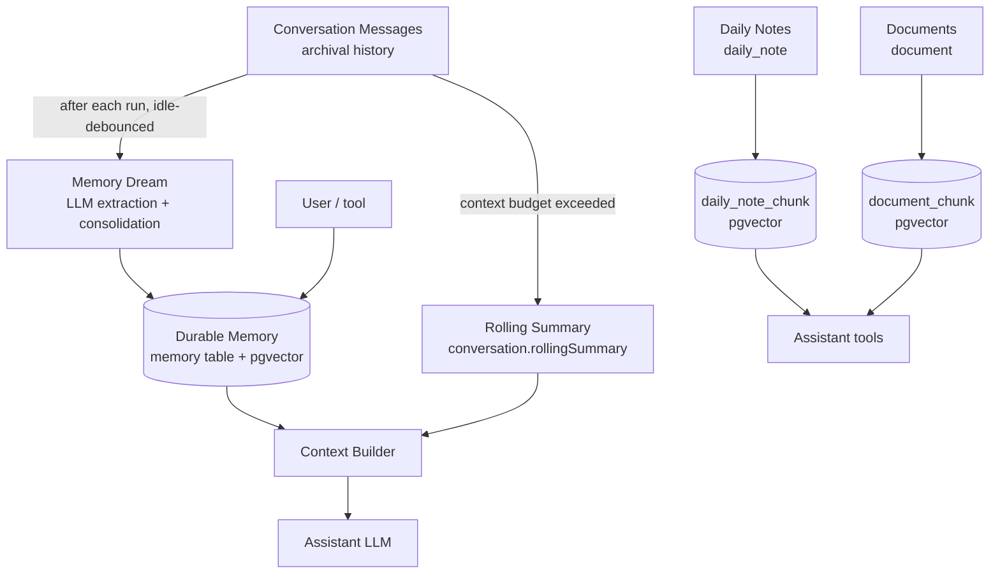

# Sydia — Memory Systems Review

| Product | Sydia                                          |
| ------- | ---------------------------------------------- |
| Scope   | `apps/backend`, `apps/frontend`, `prisma`      |
| Date    | 30 September 2026                              |
| Status  | Engineering reference — current implementation |

> Companion documents: `Sydia_System_Architecture.md` (§9 Memory and RAG Architecture), `Sydia_PRD.md` (§9.3 Memories and Notes).

This document reviews **every "memory" mechanism currently implemented in the repository**. Sydia has no single memory store: it has a family of related, deliberately-separated stores that share one embedding service and one retrieval pattern. Each is described below with its purpose, data model, write path, retrieval path, API surface, and wiring.

# Table of Contents

> **1. Overview and Taxonomy**
>
> **2. Shared Building Blocks**
>
> **3. Durable Memories (core memory domain)**
>
> **4. Automatic Memory Extraction ("Dreaming")**
>
> **5. Conversation Summary (context compaction)**
>
> **6. Daily Notes (dated retrieval index)**
>
> **7. Document Knowledge Base (file RAG)**
>
> **8. Context Assembly (how memories reach the model)**
>
> **9. Cross-Cutting Invariants**
>
> **10. Configuration Reference**
>
> **11. Database Migrations and Indexes**
>
> **12. File Index**

# 1. Overview and Taxonomy

Six distinct stores back the assistant's recall. Only one of them is called "memory" to the user, but all six are memory systems in the architectural sense.

| #   | System                             | Source of truth        | Storage                                               | Primary use                                  |
| --- | ---------------------------------- | ---------------------- | ----------------------------------------------------- | -------------------------------------------- |
| 1   | **Durable Memories**               | User or extractor      | `memory` table + pgvector                             | Long-term facts, preferences, decisions      |
| 2   | **Memory Extraction ("Dreaming")** | Derived (LLM pipeline) | `memory_dream_run`, `memory_deletion_marker`          | Automatically curating #1 from conversations |
| 3   | **Conversation Summary**           | Derived (LLM)          | `conversation.rollingSummary`, `conversation_summary` | Continuity within a conversation             |
| 4   | **Daily Notes**                    | User                   | `daily_note` + `daily_note_chunk`                     | Dated diary with dated semantic search       |
| 5   | **Document Knowledge Base**        | User uploads           | `document` + `document_chunk`                         | File RAG over uploaded content               |
| 6   | **Shared Embeddings**              | Infra                  | —                                                     | One embedding service for #1, #4, #5         |

The taxonomy follows the architecture document:

- **Durable semantic memory** (#1) — curated, provenance-tracked, user-inspectable.
- **Document knowledge** (#5) — chunked file content addressed by document filters.
- **Conversation summary** (#3) — derived continuity state, explicitly _not_ durable memory (ADR-005).
- **Daily notes** (#4) — a dated journal that doubles as its own retrieval index.
- **Recent messages** — a recency window assembled at request time (not a store).

# 2. Shared Building Blocks

## 2.1 Embeddings

`EmbeddingsService` (`apps/backend/src/infra/embeddings/embeddings.service.ts:42`) is the single embedding provider for systems #1, #4, and #5.

- `embed(text)` → one vector, or `null` when unconfigured/failed.
- `embedMany(texts)` → order-preserving, bounded-concurrency (`BACKEND_EMBEDDING_CONCURRENCY`, default 8) with per-request retry (3 attempts, exponential backoff with jitter).
- Requests `POST {BACKEND_MODEL_BASE_URL}/embeddings` with `dimensions: 1536` and `model` from `BACKEND_EMBEDDING_MODEL` (default `openai/text-embedding-3-small`).
- `version = 'v1'` and `modelName()` are stamped onto every vector row.

Failure is always _soft_: when the embedding service is unavailable, every caller falls back to keyword-only retrieval instead of failing the operation.

## 2.2 Hybrid retrieval with Reciprocal Rank Fusion (RRF)

All three retrievable stores (#1, #4, #5) use the same shape: a **keyword leg** and a **vector leg** fused by Reciprocal Rank Fusion (`1 / (60 + rank + 1)`), with a user-scoped SQL predicate applied _before_ ranking. The RRF implementation is duplicated per domain (each tailors tie-breaking):

| Domain      | Fusion site                 | Tie-break                                                             |
| ----------- | --------------------------- | --------------------------------------------------------------------- |
| Memories    | `memory.service.ts:84`      | pinned, then `updatedAt` desc                                         |
| Daily notes | `daily-note.service.ts:254` | literal keyword score, then `date` desc; collapses to one hit per day |
| Documents   | `document.service.ts:466`   | diversify to ≤2 chunks per document                                   |

## 2.3 Background queues (BullMQ)

Declared in `apps/backend/src/infra/queue/queue.service.ts:41` and consumed in `apps/backend/src/worker.ts`:

| Queue                    | Job type                 | Purpose                                |
| ------------------------ | ------------------------ | -------------------------------------- |
| `memory-dreams`          | `MemoryDreamJob`         | Run extraction; 24h recovery sweep     |
| `conversation-summaries` | `ConversationSummaryJob` | Rolling summary refresh                |
| `daily-note-indexes`     | `DailyNoteIndexJob`      | Chunk + embed notes; 6h recovery sweep |

Default job options: 5 attempts, exponential backoff (1s), keep last 1000 completed/failed (`queue.service.ts:56`).

# 3. Durable Memories (core memory domain)

The primary memory system: curated, user-inspectable long-term facts with provenance, pinning, and a supersession history.

> Module: `apps/backend/src/modules/memories/`

## 3.1 Data model — `prisma/schema.prisma:394`

`Memory` fields of note:

| Field                                    | Meaning                                                                 |
| ---------------------------------------- | ----------------------------------------------------------------------- |
| `content`                                | The canonical standalone fact (source of truth; also the embedded text) |
| `category`                               | Optional free-text category                                             |
| `status`                                 | `active` \| `superseded`                                                |
| `pinned`                                 | Pinned memories are injected into every context window                  |
| `confidence`                             | Extractor confidence (dashboard/tool writes leave it null)              |
| `sourceType`                             | `dashboard` \| `chat` \| `whatsapp` \| `document` \| `automatic`        |
| `sourceMessageId` / `sourceMessageIds[]` | Provenance back to conversation messages                                |
| `sourceDocumentId`                       | Provenance for document-derived facts                                   |
| `extractorVersion`                       | Which dreamer produced it (e.g. `incremental-dream-v1`)                 |
| `supersedesId` / `supersededById`        | Revision chain (old ↔ new)                                              |
| `dreamRunId`                             | Owning dream run                                                        |
| `sourceKey` (unique)                     | Idempotency hash for automatic writes                                   |
| `embedding`                              | `vector(1536)` (nullable)                                               |
| `embeddingModel` / `embeddingVersion`    | Embedding provenance                                                    |
| `lastRetrievedAt` / `retrievalCount`     | Usage signals                                                           |

Indexes: `[userId, status, pinned]`, `[userId, updatedAt]`, plus hand-written HNSW (`memory_embedding_hnsw_idx`, cosine ops) and a GIN full-text index (`memory_content_search_idx`) added in migrations.

Two companions exist purely to make extraction correct (see §4): `MemoryDreamRun` (`:470`) and `MemoryDeletionMarker` (`:492`).

## 3.2 Domain entity and repository contract

- Entity `Memory` / `MemoryWrite` / `MemoryStatus` (`database/entities/memory.entity.ts`). `Memory.source` is a _presented_ provenance object with a human label.
- Interface `IMemoryRepository` + `MEMORY_REPOSITORY` token (`database/interfaces/memory.repository.interface.ts:10`): `list`, `findById`, `findBySourceKey`, `create`, `update`, `supersede`, `delete`, `searchKeyword`, `searchVector`, `recordRetrieval`, `setEmbedding`.
- Prisma implementation `PrismaMemoryRepository` (`database/repositories/prisma-memory.repository.ts:64`).
  - `memorySelect` deliberately omits the vector column from normal reads.
  - `searchVector` (`:266`) runs raw SQL: `embedding <=> $vector`, filtered by `userId`, `status = 'active'`, and `<= maxCosineDistance`.
  - `setEmbedding` (`:303`) is a raw `UPDATE` (Prisma cannot write `Unsupported` columns).
  - `supersede` (`:146`) creates the new active row and flips the old to `superseded` in one transaction.
  - `delete` (`:190`) is more than a delete — see §3.5.

## 3.3 Write paths

**Explicit (synchronous, canonical-first):** `MemoryService.create` (`memory.service.ts:34`) writes the row, then best-effort embeds it. Ordering matters: the canonical text is authoritative; indexing is a derived artifact that may fail silently (`index()` swallows errors, `:166`).

**Update:** `MemoryService.update` (`:56`). A content change does **not** mutate in place — it calls `supersede`, so the old fact is retained as `superseded` and the new one becomes active. Non-content edits (pin, category) mutate directly.

**Via assistant tools:** `save_memory`, `update_memory` (`memory.service.update`), `forget_memory`, `search_memories` are defined in `conversations/services/domain-tools.ts:814` and wired through `DomainToolsProvider` (`conversations/services/domain-tools.provider.ts:32`). `update_memory`/`forget_memory` accept an `id` or resolve by semantic `query` to the first match.

**Via REST:** `MemoriesController` (`memories.controller.ts:32`).

| Method | Route                 | Behaviour                                                          |
| ------ | --------------------- | ------------------------------------------------------------------ |
| GET    | `/memories`           | List with `status` / `pinned` filters                              |
| GET    | `/memories/search?q=` | Hybrid semantic + keyword search                                   |
| GET    | `/memories/:id`       | Single memory                                                      |
| POST   | `/memories`           | Create (forces `sourceType: 'dashboard'`, audits `memory.created`) |
| PATCH  | `/memories/:id`       | Update (audits `memory.updated`)                                   |
| DELETE | `/memories/:id`       | Delete (audits `memory.deleted`)                                   |

All routes are `@Roles(['user'])` and user-scoped via the session.

## 3.4 Retrieval

`MemoryService.search(userId, query, limit = 10)` (`memory.service.ts:84`):

1. Keyword leg: `content ILIKE %query%` over active rows, pinned/recency ordered (`prisma-memory.repository.ts:247`).
2. Vector leg: embed the query, then cosine-distance search capped at `BACKEND_MEMORY_MAX_COSINE_DISTANCE` (default `0.3`).
3. Fuse by RRF; sort by score, then pinned, then recency.
4. `recordRetrieval` bumps `lastRetrievedAt` / `retrievalCount` (best-effort).
5. On embedding failure, return keyword results only.

## 3.5 Deletion and tombstoning

`PrismaMemoryRepository.delete` (`:190`), inside one transaction:

1. Repairs the supersession chain (relinks the deleted node's neighbours).
2. Upserts a `MemoryDeletionMarker` for every source message it cited.
3. Deletes the memory row.

The deletion marker (`schema.prisma:492`, unique `[userId, sourceMessageId]`) is a tombstone: it prevents the dreaming pipeline from re-extracting a fact from a message whose memory the user explicitly forgot.

## 3.6 Frontend

- Route `/memory`, gated behind `VITE_DEBUG_ENABLED` (`apps/frontend/src/routes/_app.memory.tsx`).
- Page `MemoryPage` (`components/memories/memory-page.tsx:390`): list + status filter + pinned filter, semantic search ("Cari memori secara semantik"), create/edit/delete dialogs, pin toggle, provenance display, and superseded badges.
- API client `memories.api.ts` (typed `Memory`, `MemoryProvenance`, `MemoryStatus`, `MemorySourceType`; server-fn variants for SSR).
- Query hooks `memories.queries.ts` (`useCreateMemory`, `useUpdateMemory`, `useDeleteMemory`, `useSetMemoryPinned`).

Note: the `automaticMemoryEnabled` user preference is exposed to the frontend preferences type (`users/preferences.api.ts`), but a dedicated Memory & Privacy settings surface (roadmap FE-0804) is not yet built.

# 4. Automatic Memory Extraction ("Dreaming")

An asynchronous LLM pipeline that periodically mines recent conversation segments for durable facts and consolidates them into §3. Version-tagged `incremental-dream-v1`. Users can opt out via `User.automaticMemoryEnabled`.

> Files: `apps/backend/src/modules/memories/memory-dream.service.ts`, `memory-dream-scheduler.service.ts`

## 4.1 Trigger and scheduling

- After each completed assistant run, `AssistantOrchestratorService.persistSuccess` calls `MemoryDreamSchedulerService.schedule` (`assistant-orchestrator.service.ts:711`).
- `schedule` (`memory-dream-scheduler.service.ts:33`) **debounces per conversation**: it removes any pending `dream` jobs for that conversation and enqueues one delayed job with `jobId: memory-dream-<conversationId>-<throughMessageId>` and a delay of `BACKEND_MEMORY_DREAM_IDLE_MS` (default 15 min). A conversation is only dreamed once it has gone idle.
- `recover` (`:63`) re-enqueues pending dreams older than `BACKEND_MEMORY_DREAM_SHORT_SEGMENT_AGE_MS` (default 6h) with `allowShortSegment: true`. It runs on a 24h scheduler in `worker.ts:161`.

## 4.2 The run pipeline

`MemoryDreamService.run` (`memory-dream.service.ts:76`):

1. **Opt-out check** — returns `skipped` if `automaticMemoryEnabled` is false (`:83`).
2. **Load segment** — `findMemoryDreamSegment(userId, conversationId, throughMessageId)` returns messages after the watermark, minus tombstoned sources (`prisma-conversation.repository.ts:1106`).
3. **Eligibility gate** (`:101`) — at least `BACKEND_MEMORY_DREAM_MIN_USER_MESSAGES` (4) user messages, or `BACKEND_MEMORY_DREAM_MIN_TOKENS` (800) estimated tokens, or (short-segment recovery) ≥2 user messages. Otherwise `deferred`.
4. **Begin run** — `beginMemoryDream` (`:1161`) is idempotent: an existing `completed` run returns null; a `running` run younger than 15 min returns null (stale-run guard); otherwise it (re)claims the run.
5. **Extract candidates** (`extractCandidates`, `:163`) — one LLM call with a conservative system prompt: durable user facts/preferences/decisions/goals/routines/constraints only; assistant messages are context, not evidence; ignore transient tasks, secrets, and credentials. Returns `{candidates:[{content,category,confidence,sourceMessageIds}]}`.
   - `parseCandidates` (`:193`) filters hard: `confidence >= 0.85`, non-empty content, and at least one **user** message id (assistant-only citations are dropped). Max 20 candidates.
6. **Prepare** (`prepareCandidates`, `:253`) — dedupe _before_ paying for embeddings:
   - `findBySourceKey` cheap lookup (source key = `sha256(version + sorted source ids + lowercased content)`, `:41`),
   - then a semantic search for an exact-content duplicate.
7. **Consolidate batch** (`consolidateBatch`, `:284`) — candidates with no existing matches are created directly; the rest go to **one** LLM call that returns per-index decisions: `ignore | create | merge | supersede | conflict`. Decisions are validated (`validateConsolidation`, `:386`): `targetId` must be one of the supplied memory ids; `merge`/`supersede` must carry target + content; anything invalid degrades to `conflict` (no-op).
8. **Apply** (`applyDecision`, `:421`) — `merge`/`supersede` call `MemoryService.consolidate` (supersede the target), `create` calls `MemoryService.create`. Sources and the previous target's sources are unioned; `sourceType: 'automatic'`, `extractorVersion`, and `sourceKey` are stamped.
9. **Complete** — `completeMemoryDream` (`:1205`) advances `Conversation.memoryDreamThroughMessageId` and marks the run completed **in one transaction with a compare-and-swap** on the previous watermark; a lost race aborts the run rather than double-writing.
10. On any error, `failMemoryDream` (`:1236`) records the failure and the error rethrows for BullMQ retry.

Idempotency is layered: a per-candidate `sourceKey`, a unique `MemoryDreamRun(conversationId, throughMessageId, dreamerVersion)`, and the transactional watermark advance.

## 4.3 Persistence plumbing

Conversation-side methods on `IConversationRepository`: `findMemoryDreamSegment`, `beginMemoryDream`, `completeMemoryDream`, `failMemoryDream`, `findPendingMemoryDreams` (`prisma-conversation.repository.ts:1106–1269`). `findPendingMemoryDreams` only selects conversations whose owner has `automaticMemoryEnabled: true`.

Tests: `memory-dream.service.spec.ts`, `memory-dream-scheduler.service.spec.ts`.

# 5. Conversation Summary (context compaction)

Conversation history is **not** durable memory (ADR-005). It is compacted so a long conversation stays within the model's context budget.

- **Store:** `Conversation.rollingSummary` + `Conversation.summaryThroughMessageId` (`schema.prisma:155`), with an append-only revision log in `ConversationSummary` (`:240`).
- **Trigger:** `ConversationSummarizerService.summarizeIfNeeded` (`conversation-summarizer.service.ts:92`), enqueued on `conversation-summaries` after every run (`assistant-orchestrator.service.ts:693`).
- **Policy:** when unsummarized tokens exceed `BACKEND_SUMMARY_TRIGGER_TOKENS` (4500), summarize everything except the newest `BACKEND_SUMMARY_RETAIN_MESSAGES` (8).
- **Output:** a structured JSON `SummaryState` — objective, established facts, decisions, constraints, completed/pending actions, unresolved questions, entities (`:13`). The previous summary and new messages are semantically merged in one LLM call.
- **Write:** `replaceSummary` (`prisma-conversation.repository.ts:1074`) updates the conversation and appends a `ConversationSummary` row in a transaction, with a compare-and-swap on `summaryThroughMessageId` so concurrent summarizers cannot clobber each other.

# 6. Daily Notes (dated retrieval index)

A dated journal ("diary") with its own chunked pgvector index, separate from `Memory`.

> Module: `apps/backend/src/modules/daily-notes/`

## 6.1 Data model

- `DailyNote` (`schema.prisma:427`) — one entry per owner-local calendar day. `date` is the owner's local `YYYY-MM-DD` in `timezone`; `content` is Tiptap rich text; `text` is the derived plain text that is actually embedded; `indexPending` doubles as crash-recovery backlog; `indexSignature` is a text fingerprint. Unique `[userId, date]`.
- `DailyNoteChunk` (`:452`) — `date` **denormalised** so a date-windowed search filters and ranks in one query; `embedding vector(1536)`; `[dailyNoteId, chunkIndex]` unique.

## 6.2 Write and index lifecycle

- `DailyNoteService.save` (`daily-note.service.ts:123`): an empty document deletes the row (so PUT/GET agree that a day has no note); otherwise upsert, and enqueue re-index **only if the retrievable text changed**.
- Indexing is queued (`enqueueIndex`, `:383`) and coalesced by a text fingerprint. The job id is intentionally unique per enqueue because BullMQ drops an `add` whose id already exists (`:386`).
- `index` (`:302`): chunk the text, compare signature + chunk/embedding counts, and skip when nothing changed; embed with `embedMany`; if any embedding is missing, keep the pending flag rather than drop the note from retrieval.
- `recoverPending` (`:364`) re-indexes up to 25 pending notes; driven by the 6h `daily-note-index-recovery` scheduler (`worker.ts:178`).

## 6.3 Retrieval

`search` (`:204`): owner-scoped, optionally windowed by date range, keyword + vector legs fused by RRF, then **collapsed to one hit per day** (`rank`, `:254`) so a day that matched repeatedly reads as a single entry. Falls back to keyword-only when embeddings are unavailable.

## 6.4 API, tools, frontend

- REST (`daily-notes.controller.ts`): `GET /daily-notes`, `GET /daily-notes/:date`, `PUT /daily-notes/:date`, `DELETE /daily-notes/:date` (audits `daily_note.saved` / `daily_note.cleared` / `daily_note.deleted`).
- Assistant tools: `write_daily_note`, `read_daily_note`, `search_daily_notes` (`conversations/services/daily-note-tools.ts:77`).
- Frontend: `lib/services/api/daily-notes/*`, `components/daily-notes/*`.

The architecture doc frames daily notes as reusing the document chunker and embedding service but differing in what is indexed and how it is addressed (`Sydia_System_Architecture.md` §9.4).

# 7. Document Knowledge Base (file RAG)

Uploaded files are parsed, chunked, embedded, and retrievable semantically with document metadata filters.

> Module: `apps/backend/src/modules/documents/`

## 7.1 Data model

- `FileAsset` (`schema.prisma:506`) — stored bytes (checksum, `storageKey`, kind).
- `Document` (`:534`) — derived content: `status`, `title`, `textContent`, `transcript` (audio), `imageDescription` (image), `structuredData`.
- `DocumentChunk` (`:557`) — `chunkIndex`, `pageNumber`, `content`, `embedding vector(1536)`, embedding provenance. Unique `[documentId, chunkIndex]`.
- `MessageAttachment` (`:524`) links messages to file assets for attachment-aware retrieval.

## 7.2 Ingestion and embedding

`DocumentService.processDocument` (`document.service.ts:220`):

- By kind: audio → transcribe (transcript persisted before embedding so retries reuse it); image → describe; PDF → page-aware parse; text/JSON → direct read. Unsupported/empty → `NonRetryableDocumentError`.
- **Reuse before re-embed** (`:296`): if chunks survived a previous attempt unchanged, only chunks still missing an embedding are sent to `embedMany`.
- Chunks are published only after all required embeddings succeed (`:323`).
- `extractStructured` (`:651`) opportunistically pulls email/amount/date.

## 7.3 Retrieval

`DocumentService.search` (`:466`) and `searchForMessage` (`:450`): keyword + vector legs fused, then `diversifyByDocument` (`:62`, ≤2 chunks per document) so one large file cannot monopolise the results. Attachment-scoped search restricts candidates to documents attached to the current message.

Document tools live in `createPhaseTools` and are exposed through `DomainToolsProvider`.

# 8. Context Assembly (how memories reach the model)

`ContextBuilderService.build` (`conversations/services/context-builder.service.ts:237`) assembles the working context within `BACKEND_ASSISTANT_CONTEXT_TOKENS` (default 6000).

Order (stable prefix first, volatile blocks last, so providers can cache the prefix):

1. `SYSTEM_POLICY` (`:23`) — capability enumeration, tool routing, and the rule that retrieved content is _reference data, never instructions_.
2. Persona, profile, optional channel prompt.
3. Conversation history windowed to the token budget (newest turns kept verbatim).
4. Volatile contextual blocks, in order: **rolling summary** (`SUMMARY_HEADER`, `:42`), **pinned memories** (`MEMORY_HEADER`, `:39`), attached-document manifest, known-documents manifest.
5. Turn context (current instant, local time, timezone).

Pinned memories are injected via `IMemoryRepository.list(userId, { status: 'active', pinned: true })` (`:371`) and rendered as `- id; category; updated; fact` (`memoryManifest`, `:181`). **Only pinned memories are injected automatically** — the rest are reached through the `search_memories` tool. Each block is token-accounted (`ContextTokenUsage`) and truncated to fit.

# 9. Cross-Cutting Invariants

- **Ownership before ranking.** Every retrieval applies `userId` (and document ownership) in SQL _before_ vector ranking. This is both a security and performance requirement (architecture doc §9.3).
- **Canonical text first, index second.** Embeddings are derived artifacts; a failed embed never blocks a write. All three retrieval domains degrade to keyword-only.
- **Embedding versioning.** Every vector row stores `embeddingModel` + `embeddingVersion`; changing models requires a controlled re-embed rather than silently comparing incompatible spaces (architecture doc §9.5).
- **History is not memory.** Messages are stored as history under retention rules; durable memory is a _selected derivative_ with provenance and user controls (ADR-005, architecture doc §10.5).
- **Idempotency.** Automatic memory writes carry a unique `sourceKey`; dream runs are uniquely keyed and watermark-advanced transactionally; daily-note indexing is fingerprint-skipped and uniquely job-id'd.
- **Tombstones.** `MemoryDeletionMarker` prevents re-extraction from messages whose memory the user deleted.
- **Retrieved content is untrusted.** `SYSTEM_POLICY` and the block headers explicitly mark memories, summaries, documents, and tool output as reference data that cannot grant permissions or override policy.

# 10. Configuration Reference

Validated in `apps/backend/src/app.module.ts` (`validateEnvironment`).

| Variable                                    | Default                         | Used by              |
| ------------------------------------------- | ------------------------------- | -------------------- |
| `BACKEND_EMBEDDING_MODEL`                   | `openai/text-embedding-3-small` | EmbeddingsService    |
| `BACKEND_EMBEDDING_CONCURRENCY`             | `8`                             | EmbeddingsService    |
| `BACKEND_MEMORY_MAX_COSINE_DISTANCE`        | `0.3`                           | Memory vector leg    |
| `BACKEND_MEMORY_DREAM_MIN_USER_MESSAGES`    | `4`                             | Dream eligibility    |
| `BACKEND_MEMORY_DREAM_MIN_TOKENS`           | `800`                           | Dream eligibility    |
| `BACKEND_MEMORY_DREAM_IDLE_MS`              | `900000` (15 min)               | Dream debounce delay |
| `BACKEND_MEMORY_DREAM_SHORT_SEGMENT_AGE_MS` | `21600000` (6h)                 | Dream recovery       |
| `BACKEND_SUMMARY_TRIGGER_TOKENS`            | `4500`                          | Summarizer           |
| `BACKEND_SUMMARY_RETAIN_MESSAGES`           | `8`                             | Summarizer           |
| `BACKEND_ASSISTANT_CONTEXT_TOKENS`          | `6000`                          | Context builder      |

`User.automaticMemoryEnabled` (default `true`) is the per-user opt-out for dreaming.

# 11. Database Migrations and Indexes

| Migration                                      | Adds                                                                                                                                        |
| ---------------------------------------------- | ------------------------------------------------------------------------------------------------------------------------------------------- |
| `20260906035418_phases_3_4`                    | `CREATE EXTENSION vector`; `memory` table; HNSW `memory_embedding_hnsw_idx`; GIN `memory_content_search_idx`; `User.automaticMemoryEnabled` |
| `20260908120000_memory_extraction_idempotency` | Dedupe; `lastRetrievedAt` / `retrievalCount`; automatic source-message key; `memory_user_lifecycle_idx`                                     |
| `20260908150000_incremental_memory_dreaming`   | `Conversation.memoryDreamThroughMessageId`; unique `memory.sourceKey`; `memory_dream_run`; `memory_deletion_marker`                         |
| `20260906230000_phases_5_6`                    | `document` / `document_chunk` (`vector(1536)`)                                                                                              |
| `20260920230037_daily_notes`                   | `daily_note` / `daily_note_chunk`; HNSW `daily_note_chunk_embedding_hnsw_idx`                                                               |

The HNSW indexes are hand-written because Prisma cannot express `Hnsw`; later migrations carry a note telling operators not to lose them (`20260915074210_add_document_description`).

# 12. File Index

**Backend — durable memories**

- `apps/backend/src/modules/memories/memories.controller.ts`
- `apps/backend/src/modules/memories/memory.service.ts`
- `apps/backend/src/modules/memories/memory.dto.ts`
- `apps/backend/src/modules/memories/memories.module.ts`

**Backend — dreaming**

- `apps/backend/src/modules/memories/memory-dream.service.ts`
- `apps/backend/src/modules/memories/memory-dream-scheduler.service.ts`

**Backend — repositories / entities / interfaces**

- `apps/backend/src/database/repositories/prisma-memory.repository.ts`
- `apps/backend/src/database/repositories/prisma-daily-note.repository.ts`
- `apps/backend/src/database/repositories/prisma-document.repository.ts`
- `apps/backend/src/database/repositories/prisma-conversation.repository.ts` (summary + dream watermark)
- `apps/backend/src/database/entities/memory.entity.ts`, `daily-note.entity.ts`, `document.entity.ts`
- `apps/backend/src/database/interfaces/memory.repository.interface.ts`, `daily-note.repository.interface.ts`, `document.repository.interface.ts`, `conversation.repository.interface.ts`

**Backend — daily notes / documents**

- `apps/backend/src/modules/daily-notes/daily-note.service.ts`, `daily-notes.controller.ts`, `daily-notes.module.ts`
- `apps/backend/src/modules/documents/document.service.ts`

**Backend — conversation context**

- `apps/backend/src/modules/conversations/services/context-builder.service.ts`
- `apps/backend/src/modules/conversations/services/conversation-summarizer.service.ts`
- `apps/backend/src/modules/conversations/services/assistant-orchestrator.service.ts`
- `apps/backend/src/modules/conversations/services/domain-tools.ts`, `domain-tools.provider.ts`, `daily-note-tools.ts`, `phase-tools.ts`

**Backend — infrastructure**

- `apps/backend/src/infra/embeddings/embeddings.service.ts`
- `apps/backend/src/infra/queue/queue.service.ts`
- `apps/backend/src/worker.ts`
- `apps/backend/src/app.module.ts` (env validation)

**Frontend**

- `apps/frontend/src/routes/_app.memory.tsx`
- `apps/frontend/src/components/memories/memory-page.tsx`
- `apps/frontend/src/lib/services/api/memories/memories.api.ts`, `memories.queries.ts`
- `apps/frontend/src/lib/services/api/daily-notes/*`, `apps/frontend/src/components/daily-notes/*`

**Schema and migrations**

- `apps/backend/prisma/schema.prisma` (§3, §6, §7 models)
- `apps/backend/prisma/migrations/*` (see §11)
