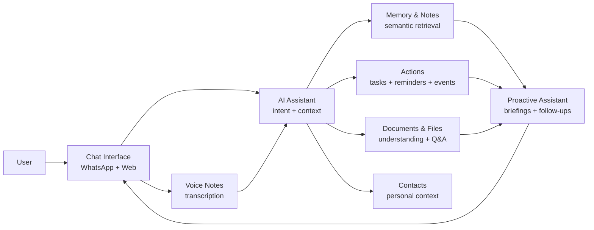

# Sydia — Product Requirements Document (PRD)

| Product | Sydia                                    |
|---------|------------------------------------------|
| Version | 0.1                                      |
| Date    | 5 September 2026                         |
| Status  | Draft for product and engineering review |

*Working specification. Pricing, packaging, and provider selections remain configurable.*

> Companion document: `Sydia_System_Architecture.md`

# Table of Contents

> **1. Executive Summary**
>
> **2. Product Context**
>
> **3. Goals, Non-Goals, and Success Metrics**
>
> **4. Target Users and Jobs-to-be-Done**
>
> **5. Product Principles**
>
> **6. Product Scope and Release Strategy**
>
> **7. Core Domain Objects**
>
> **8. Primary User Journeys**
>
> **9. Functional Requirements**
>
> 9.1 Account, Onboarding, and WhatsApp Linking
>
> 9.2 Conversational Assistant
>
> 9.3 Memories and Notes
>
> 9.4 Reminders
>
> 9.5 Tasks
>
> 9.6 Calendar and Events
>
> 9.7 Contacts
>
> 9.8 Documents and Files
>
> 9.9 Voice Notes
>
> 9.10 Search and Retrieval
>
> 9.11 Daily Briefing and Follow-ups
>
> 9.12 Web Dashboard
>
> 9.13 Settings, Privacy, and Data Controls
>
> 9.14 Subscription and Entitlements
>
> **10. AI Behavior and Memory Policy**
>
> **11. WhatsApp Product Requirements**
>
> **12. UX Requirements**
>
> **13. Analytics and Product Instrumentation**
>
> **14. Non-Functional Requirements**
>
> **15. Security and Privacy Requirements**
>
> **16. Acceptance Criteria**
>
> **17. Dependencies and Risks**
>
> **18. Rollout Plan**
>
> **19. Open Product Decisions**
>
> **Appendix A. Terminology**

# 1. Executive Summary

Sydia is a chat-first personal productivity and memory SaaS designed primarily for Indonesian users. The product uses a single business WhatsApp account as the main conversational interface, with a web dashboard for review, organization, settings, and data management.

The central product thesis is that users should not need to open multiple productivity applications or manually organize information. They should be able to send natural-language messages, documents, images, and voice notes to one assistant. The system converts actionable requests into structured state and stores useful knowledge as searchable memory.

*Figure 1. Sydia product capability map.*

| **Core product rule:** AI is the interface, not the source of truth. Tasks, reminders, events, contacts, and subscription state are deterministic application data. Conversation context is temporary. Long-term memory is curated and retrievable. |
|-----------------------------------------------------------------------------------------------------------------------------------------------------------------------------------------------------------------------------------------------------|

# 2. Product Context

## 2.1 Problem Statement

Personal information is fragmented across chats, notes, calendars, task managers, cloud files, screenshots, and voice notes. Capturing something often takes more effort than the value of recording it, while retrieving it later requires remembering where it was stored. Existing AI chat products can understand natural language but frequently lack durable, inspectable, user-controlled state.

## 2.2 Product Opportunity

WhatsApp is already an habitual communication surface for the target market. A single assistant account can become a low-friction capture and action endpoint: users message the assistant in the same way they would message a human assistant. The SaaS then provides durable memory, reminders, tasks, document understanding, semantic retrieval, and calendar actions behind that interface.

## 2.3 Positioning

Position the product as a personal assistant that remembers and takes care of small operational details, not as a generic AI chatbot. The primary value proposition is reliable capture, retrieval, and follow-through.

# 3. Goals, Non-Goals, and Success Metrics

## 3.1 Product Goals

- Provide the lowest-friction way to capture reminders, tasks, notes, files, contacts, and personal facts from WhatsApp.

- Allow users to retrieve previously stored information using natural language rather than folders or exact keywords.

- Convert conversational requests into deterministic actions with clear confirmation and easy correction.

- Provide useful proactive behavior such as reminders, daily briefings, and completion follow-ups without becoming noisy.

- Give users transparent controls over what is stored as memory and allow deletion or correction.

- Keep the system technically simple enough for a small engineering team to operate while preserving clean module boundaries for future extraction.

## 3.2 Non-Goals for MVP

- General-purpose project management for teams.

- A full CRM.

- Building an in-house video meeting platform.

- Replacing Google Drive or a dedicated document management system.

- Autonomous actions involving money, purchases, or external communication without explicit user authorization.

- An open-ended agent marketplace or user-programmable workflow engine.

- Maintaining an infinite LLM conversation context.

## 3.3 Success Metrics

| **Metric**                | **Definition**                                                       | **Initial Target / Direction**                  |
|---------------------------|----------------------------------------------------------------------|-------------------------------------------------|
| Activation                | User links WhatsApp and successfully creates or retrieves one object | \>60% of completed sign-ups                     |
| Week-4 retained users     | Activated users who perform at least one meaningful action in week 4 | Trend upward; benchmark after beta              |
| Action success rate       | Structured actions completed without user correction                 | \>=95% for reminders/tasks; \>=90% overall      |
| Reminder delivery success | Scheduled reminders accepted by messaging provider                   | \>=99% excluding provider outages/policy blocks |
| Retrieval usefulness      | Memory/document answers accepted without retry or correction         | \>=85% in evaluated test set                    |
| Median assistant latency  | Inbound text to first response for non-document requests             | Target \<5 s; monitor p95 separately            |
| Cost per active user      | Model + messaging + storage variable cost                            | Must support intended gross margin              |
| Memory correction rate    | Automatic memories later corrected or deleted as inaccurate          | Keep low; use as quality signal                 |

# 4. Target Users and Jobs-to-be-Done

## 4.1 Primary User

Individuals who already use WhatsApp heavily and need lightweight personal organization without adopting a complex productivity system. Early adopters are expected to be knowledge workers, freelancers, small-business operators, students, and professionals who routinely manage appointments, files, deadlines, contacts, and reference information.

## 4.2 Jobs-to-be-Done

| **Job**        | **User Need**                                       | **Example Outcome**                           |
|----------------|-----------------------------------------------------|-----------------------------------------------|
| Capture        | Save something immediately without organizing it    | "Remember my electricity customer number ..." |
| Act            | Turn a message into a reliable scheduled action     | Reminder/task/event created with confirmation |
| Retrieve       | Find something without remembering storage location | "What was the hotel I liked in Bali?"         |
| Understand     | Extract useful information from a file or image     | Invoice amount and due date identified        |
| Follow through | Avoid forgetting unfinished obligations             | Reminder + completion prompt / reschedule     |
| Review         | See everything important in one place               | Today view, tasks, reminders, files, memories |

# 5. Product Principles

### Conversation first

Common actions should be possible without opening the web dashboard.

### Structured where correctness matters

Tasks, reminders, contacts, events, and billing data must use deterministic domain models.

### Curated memory, not transcript dumping

Conversation history may be retained, but only useful durable information becomes long-term memory.

### Explainable state

Users must be able to inspect and correct saved memories and see what action the assistant created.

### Low-friction correction

"Move it to 3 PM" and "that is wrong" must modify existing state rather than create duplicates.

### Proactive but restrained

The assistant should notify only when there is a clear user benefit and should offer easy completion, snooze, or dismissal.

### Provider-agnostic core

Messaging and AI providers are adapters; domain rules should not depend on a specific model ID or vendor SDK.

# 6. Product Scope and Release Strategy

## 6.1 MVP Scope

| **Capability**                         | **MVP** | **Notes**                                         |
|----------------------------------------|---------|---------------------------------------------------|
| Account and authentication             | Yes     | Email/web account plus WhatsApp identity mapping  |
| Single shared WhatsApp business number | Yes     | Primary conversational channel                    |
| Web chat                               | Yes     | Useful fallback and dashboard entry point         |
| Natural-language assistant             | Yes     | Text + image; tool calling                        |
| Memories / notes                       | Yes     | Manual and selective automatic memory creation    |
| Semantic memory search                 | Yes     | Hybrid semantic + keyword retrieval               |
| Reminders                              | Yes     | One-time and recurring                            |
| Tasks                                  | Yes     | Create, list, update, complete, reschedule        |
| Contacts                               | Yes     | Lightweight personal contacts; not a CRM          |
| Documents / images                     | Yes     | Upload, parse, extract, store, retrieve           |
| Voice notes                            | Yes     | Speech-to-text then normal assistant path         |
| Google Calendar                        | Yes     | Read/create/update with explicit authorization    |
| Daily briefing                         | Yes     | Opt-in scheduled summary                          |
| Telegram                               | Later   | Adapter-ready but not MVP blocking                |
| Team delegation                        | Later   | Requires authorization and shared workspace model |
| Advanced automations                   | Later   | Start with recurring reminders and daily brief    |
| AI personas                            | Later   | Lower value than functional personalization       |

## 6.2 Release Phases

### Private alpha

Core WhatsApp loop, reminders, tasks, manual memories, basic dashboard. Focus on correctness and webhook reliability.

### Closed beta

Document ingestion, semantic retrieval, voice notes, Google Calendar, automatic memory extraction behind feature flag.

### Public beta

Subscription plans, daily briefing, refined onboarding, data export/delete controls, monitoring and cost guardrails.

### Post-MVP

Telegram, advanced automations, richer personal CRM, delegated/team workflows, additional calendar providers.

# 7. Core Domain Objects

| **Object**       | **Purpose**                                         | **Source of Truth**                        |
|------------------|-----------------------------------------------------|--------------------------------------------|
| User             | Account, timezone, preferences, subscription        | Relational DB                              |
| ExternalIdentity | Maps WhatsApp/Telegram/web identities to a user     | Relational DB                              |
| Conversation     | Logical channel/thread metadata and rolling summary | Relational DB                              |
| Message          | Archival inbound/outbound message history           | Relational DB + object storage for media   |
| Memory           | Durable semantic fact/note with provenance          | Relational DB + vector embedding           |
| Document         | Uploaded file metadata and processing state         | Relational DB + object storage             |
| DocumentChunk    | Retrievable text chunks and embeddings              | Relational DB + vector embedding           |
| Task             | Action item and status                              | Relational DB                              |
| Reminder         | Scheduled notification rule and delivery state      | Relational DB + job scheduler              |
| CalendarEvent    | Cached/integrated event state                       | Relational DB + external calendar provider |
| Contact          | Person reference used for resolution                | Relational DB                              |
| Automation       | Post-MVP scheduled/conditional behavior             | Relational DB                              |

# 8. Primary User Journeys

## 8.1 Onboarding

1. User creates a web account and selects timezone.

2. User links a WhatsApp identity using a one-time code or deep-link flow.

3. System confirms the identity mapping and sends a welcome message.

4. User is guided to try one high-value action: reminder, memory, or file upload.

5. Web dashboard reflects the action immediately.

## 8.2 Create and Modify a Reminder

User: Remind me to pay IndiHome on the 10th every month at 8 AM.

Assistant: Creates recurring reminder and confirms schedule.

User: Make it 7 AM instead.

Assistant: Resolves the prior reminder and updates it; no duplicate is created.

## 8.3 Save and Retrieve Memory

User: Remember that I usually use BCA for vendor payments.

Assistant: Confirms memory creation.

Later: Which bank do I normally use to pay vendors?

Assistant: Retrieves the relevant durable memory and answers with provenance available in the dashboard.

## 8.4 Document Understanding

User sends invoice.pdf.

Assistant: Identifies vendor, amount, invoice number, and due date.

User: Remind me three days before it is due.

Assistant: Creates reminder linked to the source document.

## 8.5 Contextual Follow-up

User: Meeting with Rani tomorrow at 10.

Assistant: Creates event.

User: Move it to 2 PM.

Assistant: Uses recent working context to update the same event.

# 9. Functional Requirements

## 9.1 Account, Onboarding, and WhatsApp Linking

| **ID**     | **Requirement**                                                                                                      |
|------------|----------------------------------------------------------------------------------------------------------------------|
| FR-ACC-001 | Users can create and authenticate a web account.                                                                     |
| FR-ACC-002 | Each user has an explicit timezone used for parsing relative times and scheduling reminders.                         |
| FR-ACC-003 | A WhatsApp sender identity is mapped to exactly one active user account unless an administrator resolves a conflict. |
| FR-ACC-004 | The system does not use the phone number as the primary User ID.                                                     |
| FR-ACC-005 | Users can unlink WhatsApp from the web dashboard.                                                                    |
| FR-ACC-006 | All identity-linking flows are auditable and resistant to replay.                                                    |

## 9.2 Conversational Assistant

| **ID**     | **Requirement**                                                                                                                |
|------------|--------------------------------------------------------------------------------------------------------------------------------|
| FR-AST-001 | Accept text, image, document, and voice messages from supported channels.                                                      |
| FR-AST-002 | Resolve conversational references such as "it", "the first one", or "move that to tomorrow" using recent context.              |
| FR-AST-003 | Use explicit tools for structured actions rather than asking the model to simulate state changes.                              |
| FR-AST-004 | Return concise action confirmations that include the important interpreted fields.                                             |
| FR-AST-005 | Ask for clarification only when a required field is materially ambiguous and cannot be resolved from context or safe defaults. |
| FR-AST-006 | Support corrections and reversals without creating duplicate domain objects.                                                   |
| FR-AST-007 | Prevent the model from accessing data owned by another user.                                                                   |
| FR-AST-008 | Persist every assistant tool invocation with correlation IDs for audit/debugging.                                              |

## 9.3 Memories and Notes

| **ID**     | **Requirement**                                                                                  |
|------------|--------------------------------------------------------------------------------------------------|
| FR-MEM-001 | Users can explicitly save a memory or note through chat or dashboard.                            |
| FR-MEM-002 | Memories support type/category, content, source provenance, timestamps, and optional confidence. |
| FR-MEM-003 | Memories are embedded for semantic retrieval after creation/update.                              |
| FR-MEM-004 | Automatic memory extraction is conservative and can be disabled by the user.                     |
| FR-MEM-005 | The extractor can create, update, supersede, or ignore candidate memories.                       |
| FR-MEM-006 | The user can inspect, edit, pin, archive, and delete memories.                                   |
| FR-MEM-007 | Deleting a memory removes it from future retrieval and triggers vector/index cleanup.            |
| FR-MEM-008 | Conversation history is not automatically treated as durable memory.                             |

## 9.4 Reminders

| **ID**     | **Requirement**                                                                                                                            |
|------------|--------------------------------------------------------------------------------------------------------------------------------------------|
| FR-REM-001 | Create one-time reminders using absolute or relative time.                                                                                 |
| FR-REM-002 | Create recurring reminders using supported recurrence rules.                                                                               |
| FR-REM-003 | Update, pause, resume, cancel, complete, snooze, and reschedule reminders.                                                                 |
| FR-REM-004 | All reminders are stored as deterministic structured data.                                                                                 |
| FR-REM-005 | Reminder delivery is idempotent and records provider delivery attempts.                                                                    |
| FR-REM-006 | Outside the applicable WhatsApp conversation window, the system uses an approved message template or another permitted notification route. |
| FR-REM-007 | Users can opt out of proactive reminders globally or by reminder.                                                                          |

## 9.5 Tasks

| **ID**     | **Requirement**                                                                                                                       |
|------------|---------------------------------------------------------------------------------------------------------------------------------------|
| FR-TSK-001 | Create tasks with title, optional description, due date, priority, tags, and source.                                                  |
| FR-TSK-002 | List tasks by today, upcoming, overdue, completed, tag, or semantic reference.                                                        |
| FR-TSK-003 | Update status, due date, priority, and text through conversation.                                                                     |
| FR-TSK-004 | Tasks can optionally create associated reminders but remain separate domain objects.                                                  |
| FR-TSK-005 | Bulk operations such as "move unfinished tasks to tomorrow" require a preview or concise confirmation when the impact is non-trivial. |

## 9.6 Calendar and Events

| **ID**     | **Requirement**                                                                      |
|------------|--------------------------------------------------------------------------------------|
| FR-CAL-001 | Connect Google Calendar using OAuth with minimum required scopes.                    |
| FR-CAL-002 | Read availability and upcoming events after authorization.                           |
| FR-CAL-003 | Create, update, and cancel events through tool calls.                                |
| FR-CAL-004 | Resolve relative date/time using the user timezone.                                  |
| FR-CAL-005 | External event IDs and sync metadata are persisted for idempotent updates.           |
| FR-CAL-006 | The assistant does not invite or message third parties without explicit user intent. |

## 9.7 Contacts

| **ID**     | **Requirement**                                                                                   |
|------------|---------------------------------------------------------------------------------------------------|
| FR-CON-001 | Create and update lightweight contacts with name, aliases, phone, email, company/role, and notes. |
| FR-CON-002 | Resolve names/aliases when creating events or retrieving information.                             |
| FR-CON-003 | Exact fields such as phone number and email use structured lookup, not vector-only retrieval.     |
| FR-CON-004 | MVP does not sync the full device address book by default.                                        |

## 9.8 Documents and Files

| **ID**     | **Requirement**                                                                                                                                |
|------------|------------------------------------------------------------------------------------------------------------------------------------------------|
| FR-DOC-001 | Users can upload supported files through WhatsApp and web.                                                                                     |
| FR-DOC-002 | Original files are stored in object storage with access controlled by user ownership.                                                          |
| FR-DOC-003 | Document ingestion extracts text and metadata, then chunks and embeds retrievable text.                                                        |
| FR-DOC-004 | Use OCR or multimodal analysis only when native parsing is insufficient.                                                                       |
| FR-DOC-005 | For common structured documents, extract fields such as dates, parties, totals, invoice numbers, or identifiers when confidence is sufficient. |
| FR-DOC-006 | Users can ask questions across their files using semantic retrieval plus document metadata filters.                                            |
| FR-DOC-007 | Answers derived from documents can expose source filename and page/chunk provenance.                                                           |
| FR-DOC-008 | Deleting a document deletes or tombstones all derived chunks and embeddings.                                                                   |

## 9.9 Voice Notes

| **ID**     | **Requirement**                                                                                                               |
|------------|-------------------------------------------------------------------------------------------------------------------------------|
| FR-VOI-001 | Download inbound voice media and transcribe it using the speech-to-text provider.                                             |
| FR-VOI-002 | Persist transcription text and link it to the original message/media.                                                         |
| FR-VOI-003 | Feed transcription through the same assistant pipeline as text.                                                               |
| FR-VOI-004 | If transcription confidence or intelligibility is insufficient, the assistant asks for a retry rather than inventing content. |

## 9.10 Search and Retrieval

| **ID**     | **Requirement**                                                                                                             |
|------------|-----------------------------------------------------------------------------------------------------------------------------|
| FR-SRC-001 | Support hybrid retrieval: semantic similarity, keyword/full-text search, metadata filtering, and structured domain queries. |
| FR-SRC-002 | All retrieval queries are constrained by user ownership before ranking.                                                     |
| FR-SRC-003 | Retrieval can combine relevant memories, document chunks, contacts, and conversation summary.                               |
| FR-SRC-004 | The assistant should prefer structured data for exact values and vector retrieval for fuzzy concepts.                       |
| FR-SRC-005 | Retrieval results include source identifiers for provenance and debugging.                                                  |

## 9.11 Daily Briefing and Follow-ups

| **ID**     | **Requirement**                                                                                            |
|------------|------------------------------------------------------------------------------------------------------------|
| FR-PRO-001 | Users can opt into a daily briefing at a selected local time.                                              |
| FR-PRO-002 | Briefing summarizes relevant events, due/overdue tasks, and reminders without fabricating obligations.     |
| FR-PRO-003 | Follow-ups can ask whether a due task/reminder is complete and provide complete/snooze/reschedule actions. |
| FR-PRO-004 | Users can globally pause proactive notifications.                                                          |
| FR-PRO-005 | Proactive messages must comply with channel policy and approved template requirements.                     |

## 9.12 Web Dashboard

The dashboard is a control center, not the primary interaction surface. It must optimize inspection, correction, organization, and settings rather than analytics theater.

| **Area**         | **Required Contents**                                                |
|------------------|----------------------------------------------------------------------|
| Home / Today     | Today events, due tasks, upcoming reminders, concise assistant input |
| Inbox / Activity | Recent conversation actions and assistant activity                   |
| Tasks            | Filterable task list and edit controls                               |
| Reminders        | Upcoming, recurring, completed/disabled reminders                    |
| Calendar         | Upcoming events and connected provider status                        |
| Memory           | Search, browse, edit, delete, provenance                             |
| Files            | Uploaded documents, processing state, metadata, Q&A entry point      |
| Contacts         | Lightweight contact management                                       |
| Settings         | Assistant behavior, notifications, integrations, privacy, billing    |

## 9.13 Settings, Privacy, and Data Controls

| **ID**     | **Requirement**                                                                                       |
|------------|-------------------------------------------------------------------------------------------------------|
| FR-SET-001 | Users can control automatic memory extraction.                                                        |
| FR-SET-002 | Users can set timezone, daily briefing time, notification preferences, and assistant verbosity/style. |
| FR-SET-003 | Users can export core account data in a portable format.                                              |
| FR-SET-004 | Users can delete individual memories/documents and request account deletion.                          |
| FR-SET-005 | Connected integrations can be revoked from the dashboard.                                             |
| FR-SET-006 | Privacy settings clearly distinguish conversation history from durable memories.                      |

## 9.14 Subscription and Entitlements

Pricing is intentionally not fixed in this PRD. The product must support plan-based entitlements and metering without coupling domain logic to a specific billing provider.

| **Entitlement Dimension** | **Examples**                                 |
|---------------------------|----------------------------------------------|
| AI usage                  | Monthly assistant turns or token-cost budget |
| Storage                   | Total file storage / maximum file size       |
| Document processing       | Pages or files processed per month           |
| Voice                     | Minutes transcribed per month                |
| Memory                    | Optional count/storage cap                   |
| Proactive messages        | Daily briefing and reminder volume           |
| Integrations              | Calendar or future premium integrations      |

# 10. AI Behavior and Memory Policy

## 10.1 Context Layers

| **Layer**                    | **Purpose**                                          | **Persistence**                        |
|------------------------------|------------------------------------------------------|----------------------------------------|
| Working context              | Recent turns needed to resolve references            | Temporary per model request            |
| Conversation summary         | Compressed prior context when history exceeds budget | Persisted and replaceable              |
| Durable semantic memory      | Curated facts, preferences, notes                    | Persistent until changed/deleted       |
| Structured application state | Tasks, reminders, events, contacts                   | Authoritative persistent state         |
| Conversation history         | Audit/history and optional future extraction         | Persistent subject to retention policy |

## 10.2 Memory Extraction Rules

- Explicit "remember/save/note" instructions are high-confidence memory writes.

- Facts that are durable, user-specific, and likely useful later may be suggested or automatically stored if automatic memory is enabled.

- Tentative plans, speculation, one-off small talk, and model inferences should not become durable memories by default.

- New memories can supersede old memories while preserving provenance and revision history where practical.

- Memory retrieval must never override authoritative structured state.

- The user can inspect why a memory exists via its source message or document reference.

## 10.3 Hallucination and Confirmation Policy

The assistant should distinguish between retrieved facts, model-generated suggestions, and completed actions. It must not claim an action succeeded unless the corresponding tool or external API confirms success. For destructive or externally consequential actions, the assistant follows explicit authorization rules defined by the domain module.

# 11. WhatsApp Product Requirements

The SaaS operates a single WhatsApp Business identity. Users do not bring their own WhatsApp number as the business sender. Their personal WhatsApp sender identity is mapped to their SaaS account.

- Inbound messages arrive through official WhatsApp Business Platform webhooks.

- Webhook processing is idempotent using provider message IDs.

- Outbound replies and proactive notifications respect the current WhatsApp Business messaging rules and template requirements.

- Provider policy rules are treated as configuration/compliance dependencies because they can change over time.

- Media is downloaded only after ownership is resolved and is stored using private object keys.

- Users receive a clear message if a proactive notification cannot be sent because of provider policy, account state, or opt-out.

| **Implementation note:** The applicable customer-service window, template categories, pricing, and consent requirements must be re-verified against current Meta documentation before production launch. Do not hard-code policy assumptions into domain logic. |
|-----------------------------------------------------------------------------------------------------------------------------------------------------------------------------------------------------------------------------------------------------------------|

# 12. UX Requirements

- Confirm interpreted dates/times in the user timezone when creating scheduled actions.

- For simple successful actions, keep responses short and action-oriented.

- When the assistant interprets ambiguous content, expose the interpreted fields rather than a long explanation.

- Offer correction affordances: edit, undo/cancel, complete, snooze, reschedule.

- Do not expose vector scores, prompt internals, raw model JSON, or infrastructure terminology to users.

- Dashboard objects created from chat should show their source message/document where useful.

- Loading states for document processing may be asynchronous and must communicate processing state rather than blocking the chat indefinitely.

- Error messages should distinguish user-correctable input, provider failure, and temporary system failure.

# 13. Analytics and Product Instrumentation

| **Event**                    | **Purpose**         |
|------------------------------|---------------------|
| account_created              | Funnel              |
| whatsapp_linked              | Activation          |
| assistant_message_received   | Usage               |
| assistant_response_sent      | Reliability/latency |
| tool_call_completed          | Action success      |
| tool_call_failed             | Error monitoring    |
| memory_created               | Memory adoption     |
| memory_corrected             | Memory quality      |
| retrieval_answered           | Retrieval usage     |
| document_uploaded            | Document adoption   |
| document_ingestion_completed | Pipeline health     |
| reminder_delivered           | Delivery health     |
| reminder_completed           | Follow-through      |
| daily_brief_sent             | Proactive adoption  |
| subscription_changed         | Monetization        |

Analytics events must not include full message or document content by default. Sensitive payloads remain in application storage with access controls, while analytics uses identifiers and coarse metadata.

# 14. Non-Functional Requirements

| **Category**  | **Requirement**                                                                                                      |
|---------------|----------------------------------------------------------------------------------------------------------------------|
| Availability  | Target 99.9% monthly availability for API and webhook ingestion after public beta.                                   |
| Durability    | No acknowledged task/reminder/event creation may be lost after success response.                                     |
| Latency       | Text requests should target \<5 s median end-to-end; p95 tracked independently. Long document jobs are asynchronous. |
| Scalability   | Stateless API replicas and independently scalable workers.                                                           |
| Idempotency   | Inbound provider events and outbound scheduled actions are safe to retry.                                            |
| Isolation     | Every user-owned query is scoped by authenticated user ID before retrieval/ranking.                                  |
| Observability | Correlated logs, metrics, traces, model/tool latency, and job state.                                                 |
| Accessibility | Web dashboard targets WCAG 2.1 AA where practical.                                                                   |
| Localization  | Bahasa Indonesia first-class; system should preserve multilingual support.                                           |
| Cost control  | Per-user/model usage metering, limits, caching where safe, and configurable model routing.                           |

# 15. Security and Privacy Requirements

- TLS for all network connections; encryption at rest for managed databases/object storage.

- OAuth tokens and provider credentials encrypted using a managed secret/KMS mechanism and never logged.

- Signed/verified provider webhooks where supported.

- Private object storage; files served via short-lived signed URLs or authenticated proxy.

- Least-privilege OAuth scopes for Calendar and future integrations.

- Rate limits per user, channel identity, and IP for public endpoints.

- Prompt-injection-resistant document handling: retrieved document text is untrusted data, not system instruction.

- Account deletion workflow removes or schedules deletion of memories, documents, embeddings, provider tokens, and personally identifiable data according to policy.

- Administrative support access is audited and minimized.

- No user conversation content is sent to analytics systems unless explicitly required and documented.

# 16. Acceptance Criteria

## 16.1 MVP Release Gate

- A new user can create an account, link WhatsApp, and receive a successful assistant response.

- Creating, modifying, and cancelling reminders works reliably across timezone boundaries and retries.

- Task creation/update/complete operations do not create duplicates when the same webhook is retried.

- A saved memory can be semantically retrieved by a differently worded query and can be deleted from future retrieval.

- A PDF with extractable text can be ingested, chunked, embedded, and queried with source provenance.

- A voice note can be transcribed and used to create at least one supported structured action.

- Recent conversational references can update an existing object instead of creating a new one.

- Rolling summary is generated when context exceeds the configured budget, while recent turns remain available.

- User A cannot retrieve any memory, document, task, or message belonging to User B in automated security tests.

- All proactive WhatsApp messages use a permitted delivery mechanism under the current provider policy.

- Basic export/delete flows are available before public beta.

# 17. Dependencies and Risks

| **Risk / Dependency**               | **Impact**                    | **Mitigation**                                                                       |
|-------------------------------------|-------------------------------|--------------------------------------------------------------------------------------|
| WhatsApp policy or template changes | Can block proactive reminders | Abstract channel policy; maintain approved templates; verify before release          |
| LLM misinterpretation               | Wrong action or memory        | Structured outputs, tool validation, low-friction correction, quality tests          |
| Automatic memory pollution          | Loss of trust                 | Conservative extraction, provenance, user controls, confidence thresholds            |
| Retrieval leakage                   | Severe privacy incident       | Ownership filter before vector ranking; automated cross-user tests                   |
| Provider outage                     | Message delays or failures    | Queues, retry/backoff, status tracking, fallbacks where sensible                     |
| Variable AI cost                    | Margin risk                   | Metering, model routing, token budgets, document preprocessing                       |
| Document prompt injection           | Unsafe model behavior         | Treat content as untrusted evidence; tool authorization independent of document text |
| Timezone ambiguity                  | Missed reminders              | Explicit user timezone + clear confirmations                                         |
| Scaling media processing            | Worker bottleneck             | Async jobs and independently scalable worker pools                                   |

# 18. Rollout Plan

| **Milestone**       | **Scope**                                                                | **Exit Criteria**                                  |
|---------------------|--------------------------------------------------------------------------|----------------------------------------------------|
| M0 - Foundation     | Auth, user model, WhatsApp webhook, message persistence, basic LLM reply | Reliable inbound/outbound loop in staging          |
| M1 - Actions        | Reminder + task tools, scheduler, timezone handling                      | Automated correctness/idempotency tests pass       |
| M2 - Memory         | Memory CRUD, embeddings, hybrid retrieval, provenance                    | Evaluated retrieval quality meets beta threshold   |
| M3 - Media          | Document ingestion, image understanding, voice transcription             | Async pipelines observable and retry-safe          |
| M4 - Integrations   | Google Calendar, dashboard controls                                      | OAuth/security review complete                     |
| M5 - Proactive beta | Daily briefing, follow-ups, template messaging, subscription metering    | Provider policy verification + operational runbook |
| M6 - Public beta    | Privacy/export/delete, billing, support tooling, SLO dashboards          | Release gate acceptance criteria complete          |

# 19. Open Product Decisions

- Final brand positioning and launch messaging.

- Exact free vs paid usage limits and pricing.

- Whether automatic memory extraction is opt-in or enabled by default with onboarding disclosure.

- Conversation-history retention duration for free and paid plans.

- Whether web chat is feature-equivalent to WhatsApp at MVP or intentionally secondary.

- How much of Calendar is mirrored locally versus fetched on demand.

- Whether contacts are entirely internal or optionally synced from Google Contacts later.

- Which proactive follow-ups are enabled by default without creating notification fatigue.

- Which document types receive specialized structured extraction in MVP.

# Appendix A. Terminology

| **Term**             | **Definition**                                                                                                             |
|----------------------|----------------------------------------------------------------------------------------------------------------------------|
| Working context      | The temporary set of instructions, recent turns, summary, retrieved memories, and state sent to the model for one request. |
| Conversation history | Persisted record of user/assistant messages. It is not equivalent to memory.                                               |
| Durable memory       | Curated user information intended to be useful in future conversations.                                                    |
| RAG                  | Retrieval-augmented generation: retrieve relevant stored content and provide it as model context.                          |
| Structured state     | Authoritative domain objects such as tasks, reminders, events, and contacts.                                               |
| Hybrid retrieval     | Combination of vector similarity, keyword search, metadata filters, and structured queries.                                |
| Provenance           | Reference to the message/document/source from which a memory or answer was derived.                                        |
| Tool call            | A validated assistant-initiated request to a deterministic application function.                                           |
| Channel policy       | Provider-specific rules controlling permitted outbound messaging behavior.                                                 |
