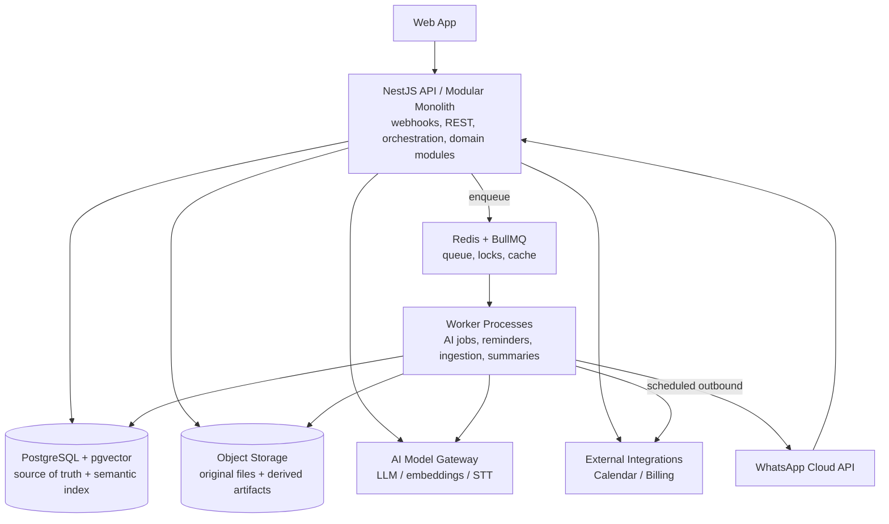
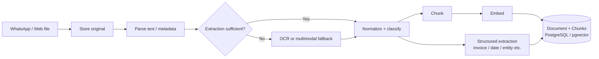
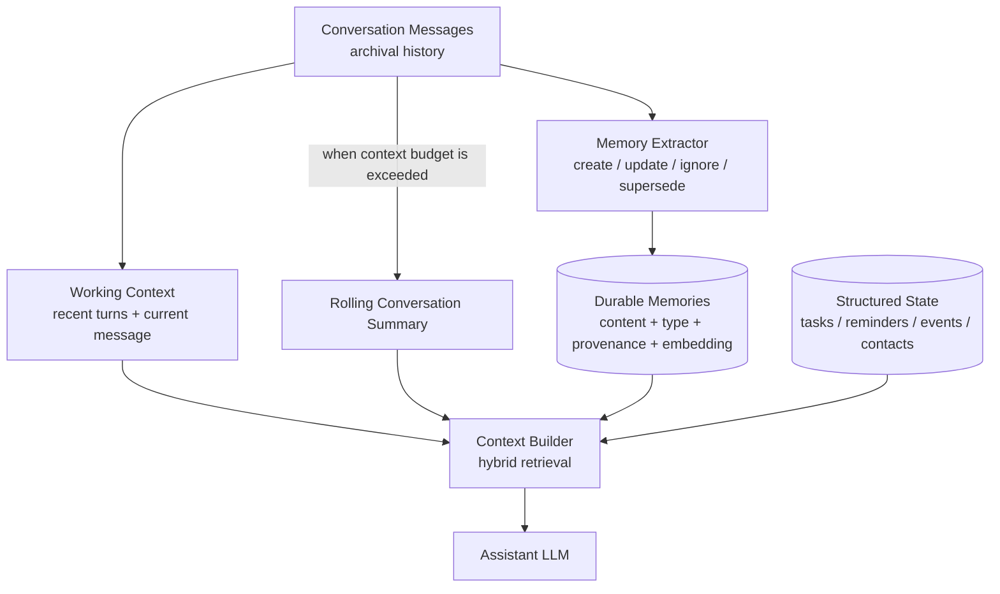
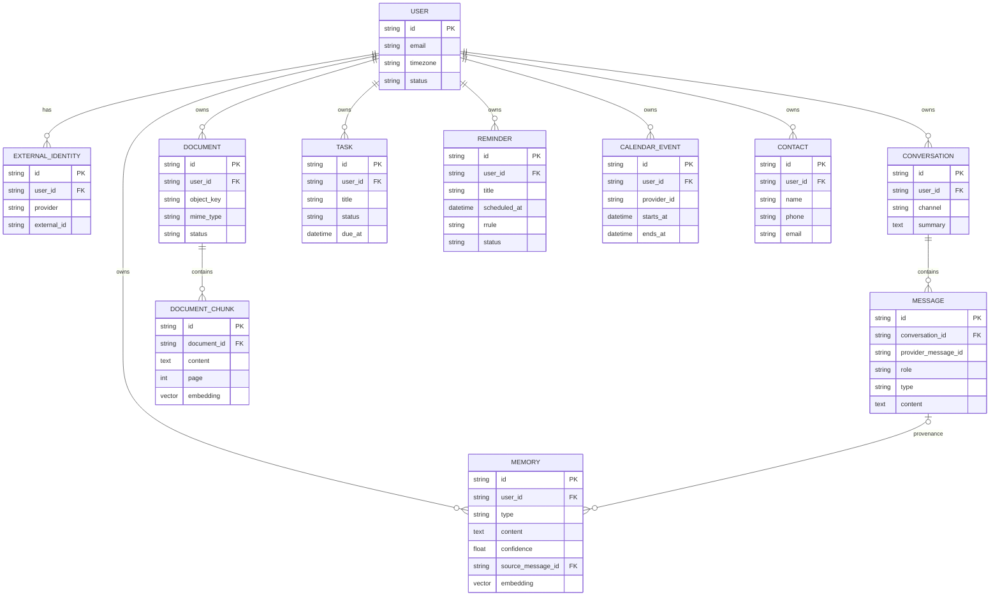

# Sydia — System Architecture Document (SAD)

| Product | Sydia                                    |
| ------- | ---------------------------------------- |
| Version | 0.1                                      |
| Date    | 5 September 2026                         |
| Status  | Draft for product and engineering review |

_Working specification. Pricing, packaging, and provider selections remain configurable._

> Companion document: `Sydia_PRD.md`

# Table of Contents

> **1. Purpose and Architecture Drivers**
>
> **2. Architecture Principles**
>
> **3. Technology Baseline**
>
> **4. System Context**
>
> **5. Container and Deployment Architecture**
>
> **6. Application Module Boundaries**
>
> **7. Key Runtime Flows**
>
> 7.1 Inbound WhatsApp Message
>
> 7.2 Scheduled Reminder
>
> 7.3 Document Ingestion
>
> 7.4 Voice Note
>
> **8. AI Orchestration Architecture**
>
> **9. Memory and RAG Architecture**
>
> **10. Conversation and Session Lifecycle**
>
> **11. Data Architecture**
>
> **12. API and Integration Contracts**
>
> **13. Background Jobs and Eventing**
>
> **14. Idempotency and Concurrency**
>
> **15. WhatsApp Integration**
>
> **16. Authentication and Authorization**
>
> **17. Security and Privacy Architecture**
>
> **18. Observability and Operations**
>
> **19. Reliability and Failure Handling**
>
> **20. Performance and Scalability**
>
> **21. Testing Strategy**
>
> **22. CI/CD and Environments**
>
> **23. Cost Controls**
>
> **24. Disaster Recovery**
>
> **25. Architectural Decisions**
>
> **26. Evolution Path**
>
> **Appendix A. Suggested Data Models**
>
> **Appendix B. Example Tool Contracts**
>
> **Appendix C. Reference Links**

# 1. Purpose and Architecture Drivers

This document defines the target architecture for Sydia as described in the companion PRD. It covers the WhatsApp-first messaging path, conversational orchestration, structured domain tools, semantic memory, document understanding, speech transcription, context lifecycle, data persistence, security, scaling, and operations.

## 1.1 Primary Drivers

- Correctness for structured actions such as reminders, tasks, and calendar updates.

- Low-friction conversational UX with recent-context reference resolution.

- Durable but controllable long-term user memory.

- Privacy isolation between individual users.

- Asynchronous processing for documents, transcription, embeddings, summaries, and scheduled notifications.

- Operational simplicity suitable for a small team.

- Provider portability for AI models, storage, messaging, and integrations.

- Cost visibility and graceful scaling rather than premature microservices.

## 1.2 Architecture Scope

The baseline is a modular monolith with independently scalable worker processes. It is deliberately not a microservice architecture. Domain boundaries and integration ports are defined so individual workloads can later be extracted if scaling, ownership, or reliability requirements justify it.

# 2. Architecture Principles

### LLM context is disposable

Each request builds a fresh working context. The system never relies on an infinite provider-side chat session.

### Application state is authoritative

The database, scheduler, and external provider responses determine whether actions exist or succeeded.

### Conversation history is archival

Messages are stored for continuity/audit according to retention rules, but are not automatically durable memory.

### Memory is curated

Long-term memory has provenance, lifecycle, user controls, and a retrieval index.

### Retrieval is hybrid

Use relational queries for exact data and vector/full-text retrieval for fuzzy semantic knowledge.

### Async by default for heavy work

Documents, embeddings, summaries, transcription, and proactive jobs run through workers.

### Idempotency at every external boundary

Provider webhook retries and worker retries must not duplicate state changes or notifications.

### Adapters isolate providers

Meta, AI vendors, Calendar, billing, and object storage are behind application interfaces.

### User ownership is filtered before ranking

Never rely on vector similarity then filter afterward for isolation.

### Observe model/tool behavior

Every model invocation and tool call has correlation IDs, latency, outcome, and cost metadata without leaking sensitive content into general logs.

# 3. Technology Baseline

| **Concern**       | **Recommended Baseline**                 | **Rationale**                                             |
| ----------------- | ---------------------------------------- | --------------------------------------------------------- |
| Backend           | NestJS + TypeScript                      | Strong modular boundaries, validation, DI, familiar stack |
| ORM               | Prisma                                   | Typed relational access; migrations reviewed carefully    |
| Primary DB        | PostgreSQL                               | Transactional source of truth                             |
| Vector search     | pgvector                                 | Avoid separate vector infrastructure for MVP              |
| Keyword search    | PostgreSQL full-text / trigram initially | Hybrid retrieval without new service                      |
| Queue / scheduler | Redis + BullMQ                           | Delayed/retryable jobs; sufficient for MVP scale          |
| Object storage    | S3-compatible private bucket             | Durable media/document storage                            |
| Web app           | Tanstack Start                           | Dashboard + web chat                                      |
| AI                | Provider-abstracted model gateway        | LLM, embedding, STT providers can change independently    |
| Observability     | OpenTelemetry + centralized logs/metrics | Correlation across API, workers, providers                |
| Deployment        | Containerized API + worker replicas      | Simple horizontal scaling                                 |
| Secrets           | Managed secret store / KMS               | Avoid credentials in application configuration files      |

| **Queue choice:** Use BullMQ rather than Kafka for the initial product. The workload is job-oriented (delays, retries, scheduled notifications, ingestion) rather than high-volume cross-service event streaming. Introduce Kafka only if a real event-streaming need appears later. |
| ------------------------------------------------------------------------------------------------------------------------------------------------------------------------------------------------------------------------------------------------------------------------------------ |

# 4. System Context

```mermaid
flowchart LR
    U[End User] -->|uses| W[Web Dashboard]
    U -->|messages / media| WA[WhatsApp Business Platform]
    W --> S[Sydia]
    WA -->|webhooks| S
    S -->|replies / templates| WA
    S --> AI[AI Provider(s)<br/>LLM / embeddings / STT]
    S --> CAL[Google Calendar<br/>and future providers]
    S --> OBJ[S3-compatible<br/>Object Storage]
    S --> BILL[Billing Provider]
```

_Figure 1. External system context._

## 4.1 External Actors and Systems

| **Actor/System**           | **Interaction**                                                                       |
| -------------------------- | ------------------------------------------------------------------------------------- |
| End user                   | Chats via WhatsApp and manages data through web dashboard.                            |
| WhatsApp Business Platform | Delivers inbound webhooks, media references, outbound replies, and template messages. |
| AI provider(s)             | Processes multimodal prompts, creates embeddings, and transcribes voice.              |
| Google Calendar            | Optional OAuth integration for event read/write.                                      |
| Object storage             | Stores private original media and derived artifacts.                                  |
| Billing provider           | Subscription checkout, entitlement/payment webhooks.                                  |
| Operations/admin           | Limited audited support/operations interface, not a user-facing core feature.         |

# 5. Container and Deployment Architecture



_Figure 2. Logical container architecture._

## 5.1 API Process

The API process is stateless except for short request-scoped state. It receives webhooks and dashboard requests, validates identities, persists messages, invokes fast synchronous assistant flows, and enqueues heavy or scheduled work.

## 5.2 Worker Process

Workers execute BullMQ jobs: document ingestion, embeddings, transcription, conversation summarization, memory extraction, scheduled reminder dispatch, daily briefing generation, provider retry, and cleanup. Worker pools can later be separated by queue if one workload dominates.

## 5.3 Data Services

- PostgreSQL stores transactional domain state, messages, metadata, summaries, memories, and vector embeddings.

- Redis stores BullMQ state, distributed locks, short-lived caches, and rate-limit counters. Redis is not a source of truth for user objects.

- Object storage keeps original media and large derived artifacts. Database rows keep ownership, metadata, hashes, and object keys.

## 5.4 Deployment Topology

```mermaid
flowchart TB
    NET[Internet / Meta Webhooks] --> EDGE[CDN / WAF / TLS]
    EDGE --> API[API Replica(s)<br/>stateless]
    API --> REDIS[(Managed Redis)]
    API --> PG[(Managed PostgreSQL<br/>+ pgvector)]
    API --> S3[(S3-compatible Storage)]
    API --> PROVIDERS[AI / Calendar / Billing Providers]

    REDIS --> WORK[Worker Replica(s)]
    WORK --> PG
    WORK --> S3
    WORK --> PROVIDERS

    API -. telemetry .-> OBS[Logs / Metrics / Traces]
    WORK -. telemetry .-> OBS
```

_Figure 3. Recommended deployment topology._

# 6. Application Module Boundaries

| **Module**      | **Responsibilities**                                                 | **Depends On**                         |
| --------------- | -------------------------------------------------------------------- | -------------------------------------- |
| Identity        | Users, sessions, external identities, linking                        | DB, auth provider                      |
| WhatsApp        | Webhook verification, normalization, outbound adapter, templates     | Identity, Conversation                 |
| Conversation    | Conversations, messages, context builder, summaries                  | DB, Memory, Assistant                  |
| Assistant       | Orchestration, tool registry, prompt policy, response composition    | Model Gateway + domain tools           |
| Model Gateway   | LLM, embeddings, transcription adapters; usage/cost metadata         | External AI providers                  |
| Memory          | Memory CRUD, extraction, embeddings, retrieval, provenance           | DB/pgvector, Model Gateway             |
| Document        | File metadata, parsing, chunking, OCR/multimodal fallback, retrieval | Object storage, workers, Model Gateway |
| Task            | Task lifecycle and query tools                                       | DB                                     |
| Reminder        | Reminder lifecycle, recurrence, scheduling, delivery state           | DB, queue, Channel adapter             |
| Calendar        | OAuth, event tools, provider sync metadata                           | Google Calendar adapter                |
| Contact         | Structured contacts and alias resolution                             | DB                                     |
| Notification    | Channel-independent proactive message intent                         | WhatsApp adapter, Reminder             |
| Entitlement     | Plans, usage limits, billing state                                   | Billing provider                       |
| Audit/Telemetry | Audit trail, traces, model/tool metrics                              | Observability stack                    |

Cross-domain behavior should be coordinated by application/orchestration services rather than direct table access. For example, the assistant calls ReminderService through a tool adapter; it does not write reminder rows directly.

# 7. Key Runtime Flows

## 7.1 Inbound WhatsApp Message


_Figure 4. Inbound message processing flow._

1. Webhook endpoint validates provider authenticity and parses events.

2. Provider message ID is checked against an idempotency record. Duplicate deliveries return success without reprocessing.

3. Sender external identity is resolved to a User. Unknown/unlinked users enter the linking/onboarding path.

4. Inbound message row is persisted before model processing.

5. Media is represented by a normalized attachment reference; heavy downloads/processing may be delegated to workers.

6. Context Builder assembles system policy, user profile, rolling summary, recent messages, relevant memories, and domain state.

7. Assistant model returns either a response or validated tool requests.

8. Tool calls execute with user-scoped authorization and validation. Results are fed back to the model if response composition needs them.

9. Outbound response is persisted and sent through the WhatsApp adapter.

10. Post-response jobs may extract durable memories, update embeddings, summarize old conversation, and record usage.

## 7.2 Scheduled Reminder

Reminder row (authoritative)

→ scheduler enqueues deterministic dispatch job

→ worker acquires idempotency lock

→ Notification module chooses channel + policy mode

→ WhatsApp adapter selects free-form reply or approved template as permitted

→ provider request is sent

→ delivery attempt/status persisted

→ retries use same dispatch key; duplicate sends are prevented

Scheduling must not depend solely on Redis delayed jobs surviving forever. The Reminder table is authoritative. A periodic reconciliation job scans due/pending reminders so the system can recover from queue loss, deployment mistakes, or Redis restoration.

## 7.3 Document Ingestion



_Figure 5. Document ingestion and indexing pipeline._

A document upload returns quickly once the original file and metadata are durably recorded. Parsing/indexing is asynchronous. Each processing stage is idempotent and updates Document.processing_status so a failed stage can be retried without re-upload.

## 7.4 Voice Note

WhatsApp audio media reference

→ authenticated media download

→ private object storage

→ STT job

→ transcription persisted on Message/Attachment

→ normalized text enters standard assistant orchestration

→ optional structured action tools

→ original audio retained/deleted according to retention policy

# 8. AI Orchestration Architecture

## 8.1 Orchestrator Responsibilities

- Build bounded working context.

- Select model tier according to request complexity/cost policy.

- Define allowed tools for the current request/channel/user entitlements.

- Validate structured model outputs against JSON/schema contracts.

- Execute tools through domain services with explicit authorization.

- Loop tool results back into the model only when necessary.

- Enforce maximum tool iterations and token/cost budgets.

- Produce a concise channel-appropriate final response.

- Persist model usage metadata and outcome.

## 8.2 Model Gateway

Domain/application code depends on interfaces, not provider SDK types. Provider-specific request construction, model IDs, retries, rate-limit handling, usage extraction, and error translation live in the Model Gateway.

interface LanguageModel {

generate(request: GenerateRequest): Promise\<GenerateResult\>

}

interface EmbeddingModel {

embed(input: string\[\]): Promise\<number\[\]\[\]\>

}

interface SpeechToTextModel {

transcribe(objectRef: MediaRef, options: TranscriptionOptions): Promise\<Transcript\>

}

## 8.3 Model Classes

| **Workload**               | **Model Class**                       | **Routing Guidance**                                     |
| -------------------------- | ------------------------------------- | -------------------------------------------------------- |
| Interactive assistant      | Fast multimodal, tool-capable LLM     | Default user request path                                |
| Complex reasoning          | Stronger reasoning tier               | Escalate only when task needs it                         |
| Memory extraction          | Small/cheap structured-output LLM     | Async; conservative policy                               |
| Conversation summarization | Small/cheap LLM                       | Async and replaceable                                    |
| Document extraction        | Parser first; multimodal LLM fallback | Use AI only when conventional extraction is insufficient |
| Embeddings                 | Dedicated embedding model             | Stable embedding version per index                       |
| Speech-to-text             | Dedicated transcription model         | Voice notes                                              |

## 8.4 Tool Safety

The model never receives raw database credentials or provider tokens. Tools expose only validated business operations. Each tool invocation carries user_id from trusted request context, not from model-provided arguments. High-impact actions can require a confirmation state even if the model requests execution.

# 9. Memory and RAG Architecture



_Figure 6. Conversation, summary, durable memory, and structured state lifecycle._

## 9.1 Memory Classes

| **Class**               | **Examples**                                   | **Retrieval Method**                         |
| ----------------------- | ---------------------------------------------- | -------------------------------------------- |
| Durable semantic memory | Preferences, facts, notes, aliases             | Vector + full-text + metadata                |
| Document knowledge      | Contract clauses, invoice text, uploaded notes | Chunk vector/full-text + document filters    |
| Structured state        | Task due dates, reminder status, phone numbers | Relational query/tool                        |
| Conversation summary    | Prior topic/state needed for continuity        | Direct context + optional semantic selection |
| Recent messages         | Pronouns, immediate edits, current task        | Recency window                               |

## 9.2 Memory Write Pipeline

1. Explicit save requests synchronously create/update a Memory record.

2. Automatic extraction runs asynchronously after selected conversation turns or a conversation boundary.

3. Extractor output schema is limited to IGNORE, CREATE, UPDATE/SUPERSEDE, and DELETE only when user intent is explicit.

4. Before creating a new memory, retrieve candidate existing memories of the same user/type to reduce duplicates.

5. Persist source_message_id/source_document_id and extractor version.

6. Generate embedding after the canonical memory text is saved. On update, re-embed and mark old vector obsolete atomically where practical.

## 9.3 Retrieval Pipeline

query

→ classify retrieval needs

→ relational/structured lookup where applicable

→ semantic embedding

→ user-scoped pgvector candidates

→ PostgreSQL full-text / metadata candidates

→ merge + rerank

→ relevance threshold / top-k budget

→ context formatter with provenance

→ assistant model

The retrieval service MUST apply user_id/document ownership predicates inside the database query before vector ranking. This is both a security requirement and a performance optimization.

## 9.4 Chunking Strategy

Start with structure-aware chunks where document parsers expose pages/headings. Use moderate token-sized chunks with small overlap rather than fixed character slicing. Store page/section metadata. Benchmark chunk size and overlap using a representative Indonesian/English test corpus instead of treating one configuration as universal.

## 9.5 Embedding Versioning

Every vector row stores embedding_model and embedding_version. Changing models requires a controlled re-embedding job and possibly a parallel index. Never silently compare embeddings generated by incompatible model spaces.

## 9.6 RAG Security

- Retrieved text is untrusted content, not system instruction.

- Document text cannot grant tool permissions or override action authorization.

- Context formatter clearly separates evidence from system policy.

- Sensitive cross-user caches are prohibited unless cache keys include authenticated ownership and are encrypted/appropriately isolated.

# 10. Conversation and Session Lifecycle

## 10.1 No Infinite Session

The product presents one continuous chat to the user, but the model receives a newly assembled working context for each request. Provider conversation/session IDs, if used at all, are optimizations rather than the source of continuity.

## 10.2 Context Builder

WorkingContext =

system_policy

\+ channel_policy

\+ user_profile/timezone/preferences

\+ rolling_conversation_summary

\+ recent_messages within token budget

\+ relevant durable memories

\+ relevant document evidence

\+ relevant structured state/tool results

\+ current user message

## 10.3 Summarization Trigger

Use a token-budget threshold rather than a fixed message count. When recent history plus retained summary approaches the configured budget, enqueue summarization for the oldest segment. Keep the newest turns verbatim. The summary is replaceable derived state and must not be the sole record of an action.

## 10.4 Conversation Boundaries

Logical conversation boundaries may be created after inactivity or topic changes for organization, but the assistant can retrieve relevant durable memory across boundaries. Inactivity should not force loss of useful context; it only influences what remains in the recency window versus summary/memory.

## 10.5 History vs Memory

| **Invariant:** Store messages as history according to retention policy. Do not automatically promote the whole transcript into memory. Durable memory is a selected derivative with provenance and user controls. |
| ----------------------------------------------------------------------------------------------------------------------------------------------------------------------------------------------------------------- |

# 11. Data Architecture



_Figure 7. Simplified core entity relationships._

## 11.1 Ownership Model

MVP is a consumer account model, not organization multi-tenancy. Every user-owned table carries user_id directly or inherits it through a parent that can be joined deterministically. Repository methods require a user scope. If shared/team workspaces are added later, introduce an explicit Workspace/Membership model rather than overloading user_id.

## 11.2 Key Indexes

| **Table**        | **Index**                                                                       |
| ---------------- | ------------------------------------------------------------------------------- |
| ExternalIdentity | UNIQUE(provider, external_id)                                                   |
| Message          | UNIQUE(channel, provider_message_id); INDEX(conversation_id, created_at)        |
| Memory           | INDEX(user_id, type); vector index on embedding with user-aware query predicate |
| Document         | INDEX(user_id, created_at, processing_status)                                   |
| DocumentChunk    | INDEX(document_id, ordinal/page); vector index on embedding                     |
| Task             | INDEX(user_id, status, due_at)                                                  |
| Reminder         | INDEX(user_id, status, scheduled_at); UNIQUE dispatch key per occurrence        |
| CalendarEvent    | UNIQUE(user_id, provider, provider_event_id)                                    |

## 11.3 Soft Delete vs Hard Delete

Operational objects such as tasks may use soft deletion if product history requires it. Privacy deletion of memories/documents/account data must eventually hard-delete or cryptographically make data unrecoverable according to the retention policy. Derived vectors and chunks must be deleted with the source object.

# 12. API and Integration Contracts

## 12.1 Public HTTP Surfaces

| **Endpoint Group** | **Purpose**                                         |
| ------------------ | --------------------------------------------------- |
| /webhooks/whatsapp | Meta webhook verification and event receipt         |
| /webhooks/billing  | Subscription/payment provider events                |
| /api/auth/\*       | Web authentication/session                          |
| /api/messages      | Web chat and activity history                       |
| /api/memories      | Memory CRUD/search                                  |
| /api/tasks         | Task CRUD/query                                     |
| /api/reminders     | Reminder CRUD/query                                 |
| /api/documents     | Upload/list/delete/query                            |
| /api/contacts      | Contact CRUD/query                                  |
| /api/calendar      | Integration status and user-facing calendar actions |
| /api/settings      | Preferences/privacy/notification controls           |

## 12.2 Internal Contracts

Domain tool interfaces are versioned TypeScript contracts validated at runtime. Model-provided arguments are schema-validated before execution. Where side effects occur, tool outputs include stable object IDs and outcome status so the assistant can reference created/updated state exactly.

# 13. Background Jobs and Eventing

| **Queue**            | **Typical Jobs**                                         | **Priority** |
| -------------------- | -------------------------------------------------------- | ------------ |
| interactive-ai       | Deferred assistant work when synchronous budget exceeded | High         |
| reminder-dispatch    | Scheduled reminder occurrences and retry                 | High         |
| media-transcription  | Voice note STT                                           | Medium       |
| document-ingestion   | Download/parse/OCR/chunk/extract                         | Medium       |
| embedding            | Memory/document embedding and re-embedding               | Medium       |
| memory-extraction    | Candidate durable memory extraction                      | Low/Medium   |
| conversation-summary | Rolling summary generation                               | Low          |
| daily-briefing       | Per-user proactive briefing                              | Medium       |
| maintenance          | Reconciliation, cleanup, retention, dead-letter replay   | Low          |

Use separate BullMQ queues or queue names to prevent large document workloads from starving reminder dispatch. Apply queue-specific concurrency and rate limits based on external provider quotas.

# 14. Idempotency and Concurrency

## 14.1 Inbound Idempotency

Persist a unique provider_message_id before side effects. A duplicate webhook returns the previously known processing status or no-op success. Do not rely only on Redis locks because Redis state can be lost.

## 14.2 Tool Idempotency

Side-effect tools can accept an internal idempotency key derived from message_id + tool_call_id. If the model or worker retries, the domain service returns the existing result.

## 14.3 Reminder Occurrences

Each recurrence occurrence has a deterministic dispatch key such as reminder_id + occurrence timestamp. A unique constraint prevents duplicate provider sends from worker retries.

## 14.4 Optimistic Concurrency

For user edits that may race with assistant updates, use updated_at/version checks for critical objects. Return a conflict to orchestration rather than silently overwriting newer state.

# 15. WhatsApp Integration

## 15.1 Identity Model

User

1 --- n ExternalIdentity

ExternalIdentity {

provider: WHATSAPP

external_id: normalized sender identifier

user_id: internal UUID/CUID

}

## 15.2 Webhook Adapter

- Verify webhook challenge/signature according to current Meta requirements.

- Normalize provider payloads into an internal IncomingMessage contract.

- Do not put provider-specific payload shapes into domain modules.

- Persist raw webhook metadata only when useful for audit/debugging and subject to privacy policy.

- Download media through provider-authenticated URLs and copy to private storage promptly if long-term retention is required.

## 15.3 Outbound Policy

The Notification module determines whether a message is a conversational reply or proactive notification. The WhatsApp adapter then chooses the currently permitted message type/template. Policy details such as conversation window, template categories, opt-in, and pricing are configuration/compliance concerns and must be validated against current Meta documentation before release.

## 15.4 Template Strategy

Maintain a small library of generic, approved utility templates for reminder, daily briefing availability, and action follow-up. Put variable content in permitted placeholders. Template names/versions are configuration data and must not leak into domain logic.

# 16. Authentication and Authorization

- Web authentication uses secure HTTP-only sessions or equivalent token strategy with CSRF protection where applicable.

- WhatsApp authentication is implicit only after a successful external identity link; sender identifiers from webhooks are not enough to create an account silently.

- Every request resolves a trusted RequestUserContext before any repository or tool call.

- Tool arguments never include authoritative user_id supplied by the model.

- OAuth integrations store provider account identifiers and encrypted refresh tokens with least-privilege scopes.

- Administrative roles are separate from user sessions and every support data access is logged.

# 17. Security and Privacy Architecture

## 17.1 Threat Model Summary

| **Threat**                      | **Control**                                                                    |
| ------------------------------- | ------------------------------------------------------------------------------ |
| Cross-user retrieval leakage    | Ownership predicate before vector/full-text ranking; repository scoping; tests |
| Webhook spoofing/replay         | Signature verification, provider message uniqueness, timestamp/policy checks   |
| Prompt injection in documents   | Untrusted-evidence boundary; tool authorization independent of retrieved text  |
| Model fabricates action success | Only tool result can authorize success language                                |
| OAuth token theft               | KMS/secret encryption, no logs, rotation/revocation                            |
| File URL leakage                | Private bucket + signed short-lived URLs                                       |
| Duplicate reminders             | Occurrence idempotency keys + unique DB constraint                             |
| Malicious large files           | MIME validation, size limits, malware scanning if required, sandboxed parsers  |
| PII in telemetry                | Structured redaction and payload-free analytics by default                     |
| Account takeover                | Strong auth/session controls, identity-link confirmation, rate limits          |

## 17.2 Encryption

Use TLS in transit. Rely on managed encryption at rest for database and object storage, plus application-level encryption for particularly sensitive provider tokens/secrets. If field-level encryption is introduced for user content, evaluate how it affects full-text/vector retrieval and key rotation before adoption.

## 17.3 Retention

Define separate retention rules for raw conversation history, audio media, original files, derived text/chunks, embeddings, logs, and backups. Deleting a source object must enqueue deletion of its derived artifacts. Backup retention may delay physical erasure but must be documented and bounded.

# 18. Observability and Operations

## 18.1 Correlation

Generate a correlation_id at webhook/API entry and propagate it through assistant calls, tool calls, BullMQ jobs, provider requests, and outbound messages. Store stable message_id/job_id/tool_call_id fields for reconstruction.

## 18.2 Metrics

| **Area**  | **Key Metrics**                                                      |
| --------- | -------------------------------------------------------------------- |
| Webhook   | rate, validation failures, duplicate rate, processing latency        |
| Assistant | latency, token usage, cost, tool-loop count, model errors            |
| Tools     | success/failure by tool, validation error, retry                     |
| Retrieval | candidate count, selected count, zero-result rate, latency           |
| Documents | queue depth, processing duration, parse/OCR failure                  |
| Reminders | due backlog, dispatch success, provider failure, duplicate prevented |
| Queues    | waiting/active/failed/delayed counts, oldest job age                 |
| Database  | connections, slow queries, vector query latency, storage growth      |
| Business  | active users, activation, memory correction, retention               |

## 18.3 Logging

Use structured logs. Avoid logging full messages, prompts, document text, access tokens, phone numbers, or signed URLs. When debugging content-specific failures requires payload inspection, use a restricted support/debug path with explicit access controls and retention.

# 19. Reliability and Failure Handling

| **Failure**                    | **Behavior**                                                                                   |
| ------------------------------ | ---------------------------------------------------------------------------------------------- |
| AI provider timeout            | Retry within bounded policy or respond with temporary failure; never duplicate completed tools |
| WhatsApp outbound failure      | Persist attempt; retry retryable codes; surface permanent policy/account failures              |
| Redis unavailable              | API can persist inbound messages; asynchronous actions degrade; reconciliation after recovery  |
| Database unavailable           | Fail fast; do not acknowledge successful state mutation                                        |
| Object storage failure         | Do not mark upload/ingestion complete; retry transfer                                          |
| Document parser crash          | Job fails to DLQ/retry; source file remains intact                                             |
| Calendar provider failure      | Do not claim event changed; keep provider error mapped to user-friendly response               |
| Worker deployment interruption | Jobs are retryable; reminder reconciliation detects missing dispatches                         |

## 19.1 Dead Letter Handling

Jobs exceeding retry policy enter a dead-letter/failed state with enough metadata to replay after correction. Operations can replay by job type/correlation ID without editing business data manually.

# 20. Performance and Scalability

## 20.1 Scaling Model

- API: horizontal stateless replicas behind a load balancer.

- Workers: scale by queue depth and workload type; reminder workers isolated from heavy ingestion.

- PostgreSQL: managed instance, connection pooling, indexes, read replica only when demonstrated necessary.

- pgvector: tune index type/parameters only after corpus size and recall/latency measurements justify it.

- Redis: managed high-availability plan once reminder scheduling is production-critical.

- Object storage: effectively elastic; enforce per-plan quotas.

- AI providers: client-side concurrency controls and rate-limit aware backoff.

## 20.2 Context Budget

Each assistant request has a configurable budget split across system policy, recent turns, summary, retrieved memories, document evidence, tool results, and output. Retrieval top-k is constrained by the remaining token budget. This prevents cost and latency from growing linearly with conversation age.

## 20.3 Caching

Cache only safe, non-authoritative data: provider metadata, model configuration, repeated embedding of identical normalized text where ownership implications are understood, and short-lived dashboard reads. Do not cache user retrieval results globally without user-scoped keys.

# 21. Testing Strategy

## 21.1 Unit and Domain Tests

- Time parsing/timezone normalization.

- Recurrence calculation.

- Task/reminder state machines.

- Memory supersede rules.

- Retrieval query construction and ownership scoping.

- Tool argument validation.

- Entitlement enforcement.

## 21.2 Integration Tests

- PostgreSQL/pgvector retrieval with real extensions.

- BullMQ retry/idempotency behavior.

- Object storage upload/delete.

- WhatsApp webhook fixture normalization.

- Calendar OAuth/event adapter with sandbox/test account.

- AI gateway using recorded/mock responses plus small live contract suite.

## 21.3 AI Evaluation Suite

Maintain a versioned evaluation corpus in Bahasa Indonesia and English covering reminder extraction, ambiguous dates, reference resolution, memory write classification, memory retrieval, document Q&A, tool selection, and refusal to treat document instructions as authorization. Model or prompt changes must run against this suite before rollout.

## 21.4 Security Tests

- Cross-user vector retrieval attempts.

- IDOR on dashboard APIs.

- Webhook replay.

- Prompt injection from uploaded documents.

- Signed URL expiry.

- OAuth token redaction in logs.

- Deletion propagation to chunks/embeddings.

# 22. CI/CD and Environments

| **Environment** | **Purpose**                                                                      |
| --------------- | -------------------------------------------------------------------------------- |
| Local           | Docker Compose: Postgres+pgvector, Redis, local object-storage emulator optional |
| Development     | Shared integration environment; test provider credentials                        |
| Staging         | Production-like infrastructure and WhatsApp test number/sandbox where available  |
| Production      | Isolated secrets/data; audited access; backups and SLO alerts                    |

CI should run lint/typecheck, unit tests, database migration validation, integration tests, AI evaluation subset, dependency/security scanning, and container build. Production migrations should use expand/contract patterns for breaking schema changes and be reversible where feasible.

# 23. Cost Controls

- Record model input/output usage and estimated cost per request/user/feature.

- Use cheap models for summarization and memory extraction; reserve stronger models for requests that need them.

- Parse documents conventionally before invoking multimodal models.

- Chunk/embed once per content version; avoid repeated embedding of unchanged text.

- Apply context token budgets and retrieval caps.

- Plan entitlements can cap storage, document pages, voice minutes, and model budget.

- Use asynchronous batch embedding where supported and operationally useful.

- Build a per-feature cost dashboard before public paid launch.

# 24. Disaster Recovery

| **Asset**              | **Protection**                           | **Recovery Consideration**                                              |
| ---------------------- | ---------------------------------------- | ----------------------------------------------------------------------- |
| PostgreSQL             | Managed backups + point-in-time recovery | Defines authoritative recovery point for user state                     |
| Object storage         | Versioning/replication policy as needed  | Original files may be recoverable independent of DB                     |
| Redis/BullMQ           | HA/snapshots depending plan              | Queue state is recoverable via DB reconciliation for critical reminders |
| Embeddings/chunks      | Derived from source text/files           | Can be rebuilt; do not treat as sole copy                               |
| Conversation summaries | Derived from message history             | Can be regenerated                                                      |
| Provider tokens        | Encrypted DB/secret store + revocation   | May require user reauthorization after restore issue                    |

Define RPO/RTO before public beta. A reasonable initial target is small data loss for transactional DB via PITR and recovery within hours, while preserving a reconciliation mechanism for scheduled reminders.

# 25. Architectural Decisions

| **ADR** | **Decision**                                      | **Reason**                                                        |
| ------- | ------------------------------------------------- | ----------------------------------------------------------------- |
| ADR-001 | Modular monolith + worker processes               | Minimize operational overhead while preserving domain boundaries  |
| ADR-002 | PostgreSQL + pgvector                             | One source of truth and sufficient semantic retrieval for MVP     |
| ADR-003 | Redis + BullMQ, not Kafka                         | Workload is delayed/retryable jobs, not event-stream platform     |
| ADR-004 | Fresh context per model request                   | Avoid infinite-session coupling and unbounded context growth      |
| ADR-005 | Conversation history separate from durable memory | Prevents memory pollution and enables user control                |
| ADR-006 | Structured state via tools                        | Correctness and auditability for actions                          |
| ADR-007 | Provider-abstracted Model Gateway                 | Model capabilities/pricing change frequently                      |
| ADR-008 | Parser-first document ingestion                   | Lower cost and better deterministic extraction before AI fallback |
| ADR-009 | User ownership filtered before vector ranking     | Privacy and security invariant                                    |
| ADR-010 | Reminder DB reconciliation                        | Queue is delivery mechanism, not sole scheduler truth             |

# 26. Evolution Path

### Scale workers by workload

Split document, reminder, and AI worker deployments without changing domain APIs.

### Dedicated retrieval service

Extract only when corpus size/query load makes Postgres/pgvector a bottleneck.

### Event streaming

Introduce Kafka or equivalent only when multiple independently deployed consumers need replayable domain-event streams.

### Workspace/team model

Add Workspace + Membership and migrate ownership from direct user scope where shared data is required.

### Multi-channel

Add Telegram/email/push through the Notification/Channel adapter interfaces.

### Advanced automation engine

Represent triggers/actions as explicit state machines after recurring reminders and briefings prove demand.

### Specialized AI routing

Introduce task-specific models or providers based on measured quality/cost, not architecture fashion.

# Appendix A. Suggested Data Models

User

\- id

\- email

\- timezone

\- status

\- created_at / updated_at

ExternalIdentity

\- id

\- user_id

\- provider

\- external_id

\- verified_at

\- unique(provider, external_id)

Conversation

\- id

\- user_id

\- channel

\- rolling_summary

\- summary_through_message_id

\- last_message_at

Message

\- id

\- conversation_id

\- provider_message_id

\- role (USER \| ASSISTANT \| SYSTEM)

\- type (TEXT \| IMAGE \| AUDIO \| DOCUMENT \| EVENT)

\- normalized_text

\- raw_metadata_json (limited)

\- created_at

Memory

\- id

\- user_id

\- type

\- canonical_text

\- confidence

\- source_message_id / source_document_id

\- status (ACTIVE \| SUPERSEDED \| ARCHIVED)

\- embedding

\- embedding_model / embedding_version

\- created_at / updated_at

Document

\- id

\- user_id

\- source_message_id

\- original_filename

\- mime_type

\- size_bytes

\- object_key

\- sha256

\- processing_status

\- extracted_metadata_json

DocumentChunk

\- id

\- document_id

\- ordinal

\- page_number

\- content

\- embedding

\- embedding_model / embedding_version

Task

\- id, user_id, title, description, status, priority, due_at, source_message_id

Reminder

\- id, user_id, title, scheduled_at, timezone, rrule, status, source_message_id

ReminderDispatch

\- id, reminder_id, occurrence_at, idempotency_key, status, provider_message_id

Contact

\- id, user_id, display_name, aliases_json, phone, email, organization, notes

CalendarConnection

\- id, user_id, provider, provider_account_id, encrypted_tokens, scopes

CalendarEvent

\- id, user_id, connection_id, provider_event_id, starts_at, ends_at, metadata_json

# Appendix B. Example Tool Contracts

create_reminder({

title: string,

scheduled_at: ISODateTime,

timezone: string,

recurrence?: string

}) → {

reminder_id: string,

status: "ACTIVE",

next_occurrence_at: ISODateTime

}

update_reminder({

reminder_id: string,

scheduled_at?: ISODateTime,

recurrence?: string,

status?: "ACTIVE" \| "PAUSED" \| "CANCELLED"

}) → ReminderSummary

search_memory({

query: string,

types?: MemoryType\[\],

limit?: number

}) → MemoryEvidence\[\]

create_task({

title: string,

due_at?: ISODateTime,

priority?: "LOW" \| "NORMAL" \| "HIGH"

}) → TaskSummary

find_calendar_events({

starts_after: ISODateTime,

starts_before: ISODateTime,

query?: string

}) → CalendarEventSummary\[\]

The trusted user context is injected by the server and is deliberately absent from model-controlled tool arguments.

# Appendix C. Reference Links

Provider documentation should be re-verified during implementation because APIs, model catalogs, messaging windows, pricing, and template policies can change.

- Meta WhatsApp Business Platform / Cloud API documentation: https://developers.facebook.com/docs/whatsapp/

- OpenAI API model and platform documentation: https://platform.openai.com/docs/

- PostgreSQL documentation: https://www.postgresql.org/docs/

- pgvector project documentation: https://github.com/pgvector/pgvector

- BullMQ documentation: https://docs.bullmq.io/

- Google Calendar API documentation: https://developers.google.com/calendar/api
