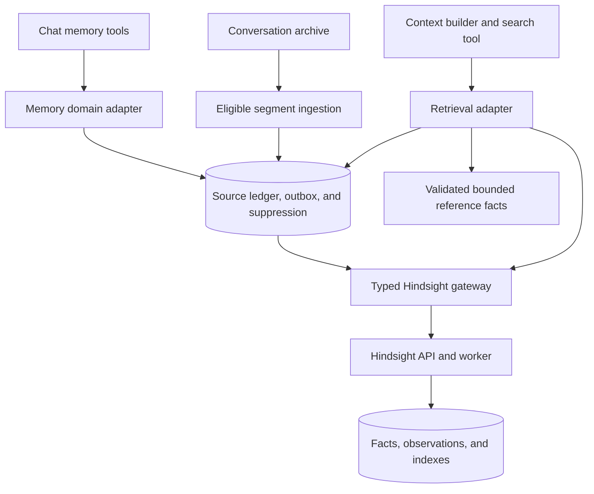

# Memory Systems Migration to Hindsight

| Field     | Value                                                                                                |
| --------- | ---------------------------------------------------------------------------------------------------- |
| Date      | 1 October 2026                                                                                       |
| Status    | Local end-to-end checks and legacy-engine cutover complete; legacy code/tables retained for rollback |
| Scope     | Long-term extraction, consolidation, retrieval, and assistant integration                            |
| Reference | [Current memory systems](./MEMORY_SYSTEM.md)                                                         |

## 1. Objective and corrected assumptions

Replace Sydia's custom long-term memory engine with Hindsight to improve recall across conversations and reduce custom inference infrastructure.

**The frontend Memory page is a debugging tool, not a public product feature.** [The route](../apps/frontend/src/routes/_app.memory.tsx) redirects to `/` unless `VITE_DEBUG_ENABLED === "true"`, and [dashboard navigation](../apps/frontend/src/components/dashboard/dashboard-shell.tsx) uses the same flag. The gate covers both navigation visibility and direct access to `/memory`. Dashboard editing, pinning, categories, status filters, and provenance displays must not be treated as public product contracts that force us to preserve the old storage model.

The earlier claim grouped debug controls and backend safeguards together as public product behavior. That was too broad. The frontend gate means manual editing, pinning, and provenance displays on this page are not migration compatibility requirements.

| Concern                                                           | Verified surface                                                                                                                                                        | Migration implication                                                                                          |
| ----------------------------------------------------------------- | ----------------------------------------------------------------------------------------------------------------------------------------------------------------------- | -------------------------------------------------------------------------------------------------------------- |
| Manual editing, pinning, categories, revision/provenance displays | Debug-only Memory page                                                                                                                                                  | Adapt or retire; do not reproduce the old CRUD schema just to retain these controls                            |
| Remember, correct, forget, and search requests                    | Chat tools: `save_memory`, `update_memory`, `forget_memory`, `search_memories`                                                                                          | Preserve useful assistant behavior through an adapter                                                          |
| Source attribution                                                | Backend evidence tracking, also displayed in debugging                                                                                                                  | Preserve enough evidence to validate facts and erase their derivatives; the current representation can change  |
| `automaticMemoryEnabled`                                          | Backend preference; declared in the [frontend preference API](../apps/frontend/src/lib/services/api/users/preferences.api.ts), with no dedicated frontend control found | Respect existing stored opt-out state without assuming a public memory-settings UI                             |
| Deletion markers                                                  | Backend protection against re-extraction of forgotten evidence                                                                                                          | Preserve the forgetting guarantee; replace the table/mechanism if Hindsight integration supports an equivalent |

Hindsight is a reasonable candidate to replace extraction, consolidation, and retrieval. The hidden management page makes that migration less constrained: a full local projection of every Hindsight fact, the existing revision schema, and pinning compatibility are unnecessary solely for debugging. Sydia still needs to own chat integration, user isolation, and forgetting policy. Evaluate those guarantees separately from the debug interface.

## 2. Scope

| System                                                       | Decision                                                                        |
| ------------------------------------------------------------ | ------------------------------------------------------------------------------- |
| Durable extraction, consolidation, embeddings, and recall    | Replace with Hindsight `retain`, observations, and `recall`                     |
| Chat remember/correct/forget/search                          | Preserve behavior through an adapter; internal payloads can change with callers |
| Debug Memory page, REST API, pinning, and revision badges    | Adapt, replace, or retire; exact compatibility is not required                  |
| Existing saved memories, including debug-created facts       | Import useful active content with provenance; exclude forgotten sources         |
| Automatic-memory backend preference                          | Honor existing state; no new settings UI in this migration                      |
| Conversation archive, recent messages, and rolling summaries | Keep existing storage and compaction                                            |
| Daily notes and document RAG                                 | Keep existing implementations and authoritative source content                  |
| Shared embeddings                                            | Keep for notes/documents and temporary legacy fallback                          |
| Assistant policy, persona, replies, and tools                | Keep the existing assistant responsible                                         |

Use `retain` and `recall` first. Defer `reflect`, mental models, knowledge pages, and indexing notes/files into Hindsight to follow-up work.

## 3. Baseline and target architecture

Today, `MemoryService.search` fuses substring keyword and vector results. `MemoryDreamService` extracts durable facts with user-message evidence and a confidence threshold of 0.85, then merges/supersedes records. Dream runs and conversation watermarks protect retries. The repository owns revisions, pins, and source-message deletion markers. Some mutation paths bypass the service.

`ContextBuilderService` automatically includes only pinned memories; other recall depends on the assistant calling `search_memories`. Replacing the search engine alone would leave this integration gap.

- **Hindsight owns the engine:** facts, observations, entities, temporal search, embeddings, and reranking.
- **Sydia owns policy and coordination:** authenticated bank selection, source references, correction/forget intents, opt-out, durable delivery, checkpoints, and erasure records.
- **Local storage stays minimal:** keep original explicit input where needed for retry and correction. A temporary fact cache may support rollback; it is not the permanent second engine.
- **References are adapter-managed:** chat receives opaque references resolving to the current user's facts/sources. Reprocessing may change remote IDs; refresh mappings or report stale references clearly. Old debug-page IDs need not remain stable forever.
- **Observations remain derived:** edit their supporting facts/sources rather than storing an editable copy of every observation.
- **One bank per user per environment:** resolve ownership server-side. Tags classify content; they are not an authorization boundary.
- **Gateway under `infra/hindsight`:** export a typed contract configured through `ConfigService`. Keep local persistence in database adapters instead of forcing inference into the old vector-storage repository contract.
- **Debugging stays separate:** adapt the gated page or use a private operator control plane. Neither is required for ordinary chat.

## 4. Required behavior

1. Chat can remember, correct, forget, and search durable facts. Acknowledge remote completion only when verified; acceptance is not completion.
2. Honor `automaticMemoryEnabled` at scheduling, dispatch, and admission of late results. Existing facts remain readable; explicit remember requests still work.
3. Require user evidence. Assistant claims, transient tasks, tool output, credentials, and sensitive data without explicit permission do not become user facts.
4. Current statements and explicit corrections outrank stale memories. Consolidation must not undo corrections or forgetting.
5. Forgetting immediately suppresses affected results and durably erases remote source data/derivatives. Invalidation alone is not permanent erasure.
6. Preserve source identity and event time for evidence and temporal recall. Deletion-marker guarantees may be reimplemented without keeping their exact table.
7. Relevant memory reaches chat through bounded automatic recall. Pinning is replaceable internal behavior, not a mandatory public feature.
8. Treat memories as reference data, never instructions; authoritative application state still comes from domain tools.
9. Account deletion schedules durable bank erasure and prevents stale jobs from recreating a deleted bank.

## 5. Implementation phases

### Implementation progress — 1 October 2026

The project owner accepted performance and accuracy and asked to wrap up testing, focus on end-to-end checks, and cut over the legacy engine. The earlier numerical quality/latency/cost targets were draft proposals and are not further rollout blockers. Keep the default semantic floor; stop additional benchmarking. The real assistant and running frontend/API/BullMQ checks are complete. Local reader and writer ownership have switched together to Hindsight. Remote production deployment requires its own environment execution; no remote settings have been changed.

| Phase | Final local status                                                                                                                                                                           | Follow-up                                                                                                      |
| ----- | -------------------------------------------------------------------------------------------------------------------------------------------------------------------------------------------- | -------------------------------------------------------------------------------------------------------------- |
| 0     | Pinned `0.10.2` capability/lifecycle contracts pass; measured performance/accuracy accepted                                                                                                  | Additional calibration deferred                                                                                |
| 1     | Private persistent API/database on loopback 8889; five additive app migrations applied; capability flags verified; paired final backups checked at an unchanged deletion boundary            | Remote production execution and its latest-intent recovery/WAL procedure                                       |
| 2     | Chat save/correct/forget/search, source evidence, owner isolation, suppression, account export/deletion and rollback lineage implemented; live contracts pass                                | Preserve hard lifecycle checks when changing providers                                                         |
| 3     | Local boundary has two original accounts and zero active legacy facts; no backfill required                                                                                                  | Use the owner-scoped resumable importer for deployments with existing facts                                    |
| 4     | Direct user-only ingestion/checkpoints and late opt-out checks pass; local ingestion enabled; Hindsight mode skips the old dreaming writer                                                   | Observe normal debounce/recovery; benchmarks deferred                                                          |
| 5     | Bounded automatic recall enabled; fresh local chat recalls chess and corrected Go without a search tool; current request placed last                                                         | Historical vague-query limitations remain documented                                                           |
| 6     | 495 ordinary tests pass; 18-turn full-tool synthetic chat contract and running frontend/API/BullMQ lifecycle check pass; hidden Memory route stays gated; valid account JSON export verified | Further quality/performance testing closed for this cutover                                                    |
| 7     | Local global-cohort cutover complete; API and worker restarted with Hindsight, automatic recall, and ingestion; legacy debug REST returns 409; verified rollback command remains available   | Observe the deployment; remote production settings were not changed                                            |
| 8     | Legacy engine inactive in the local deployment; shared notes/document embeddings and summaries remain active                                                                                 | Keep legacy code/tables for rollback; remove them with a backed-up cleanup migration after the rollback window |

The [current memory-system reference](./MEMORY_SYSTEM.md#11-validation) summarizes authenticated frontend chat submission, worker admission, fresh recall, correction, old-generation physical erasure, forgetting/export suppression, remote erasure, and account-bank cleanup. All synthetic account data was removed through the account-deletion API; the original two accounts remain. Raw Hindsight LLM/audit tables contain zero rows. There are no pending deliveries at the final backup boundary.

The running app initially exceeded the 1,500ms recall cutoff even though direct recall completed in 2.625 seconds. The local `BACKEND_HINDSIGHT_RECALL_TIMEOUT_MS` is explicitly 5,000ms; fresh recall and correction then succeeded. This changes the local operational deadline, not the semantic score floor or admission policy. New-install defaults remain opt-in.

Private pre-migration and final paired database snapshots and environment copies are stored outside the repository at `/home/bravo15/private-backups/sydia/hindsight-cutover-20261001T010759Z`. Final snapshot catalogs validate and the content-free coordination checksum is unchanged across the snapshots. These do not cover future deletion intents: after any restore, recover the latest coordination/deletion boundary before reopening reads. Test-only provider relays are stopped and dedicated synthetic containers have been removed; the application service/database remain running.

Validation so far includes backend build/type checking/scoped lint, 495 unit/regression tests in the latest full run, including replay and unsafe-capture checks. Nineteen PostgreSQL ledger scenarios pass across focused runs, including rollback races, ownership/deletion, shared-evidence closure, and physical legacy-copy erasure. Real-model checks cover ten policy fixtures; integrated chat, ingestion, backfill, and rollback contracts pass. Export and rollback CLI wiring pass isolated Nest/bootstrap checks. The recorded restored API/paired-ledger contract passes six grouped checks, including newer deletion intent applied to an older remote snapshot; deployment recovery/WAL coverage remains pending. The owner accepted the measured performance/accuracy; the running application and worker path also pass. Earlier synthetic recall varied from under a second to roughly 14 seconds; observation availability lagged retention by about 30 seconds in one run.

Performance and accuracy are accepted. Additional benchmark/threshold calibration is deferred; the optional semantic cutoff stays blank. Historical evaluation/debug outputs have been removed from `docs`. Reproducible harnesses remain in the backend tests; keep generated reports outside the documentation tree.

Integration fixes preserve admission rules: exact evidence quotations, provider-enforced JSON verdicts, exclusion of diagnostic metadata from extracted user facts, and preservation of sensitive-fact permission only when correcting already admitted facts. Fact review remains bounded to 200 facts per source and four per model call, with lease renewal and atomic final admission.

See [Hindsight operations](./hindsight_operations.md) for deployment, backup/restore, delivery recovery, and contract-test instructions. New installations still default to `legacy` until their service is configured. The local deployment has switched explicitly to `hindsight`, with automatic recall and ingestion enabled.

### Phase 0 — Capability verification and baseline

- Pin compatible server/image, SDK, extraction model, embedding model, and reranker versions. Verify runtime support and required REST operations.
- Test bank provisioning, retain/completion, fact listing, recall, evidence links, curation, document deletion, and bank deletion using synthetic fixtures.
- Verify explicit compound saves, corrections, and forgetting as logical source operations. Hindsight observations cannot be patched directly; corrections target supporting facts/documents.
- Define evidence granularity and admission rules. Preserve the existing confidence rule during the old-extractor bridge; do not invent an equivalent Hindsight confidence score.
- If message-level evidence cannot be resolved safely, use smaller documents or quarantine the affected segment.
- Measure current answer/recall outcomes, freshness, latency, context tokens, and cost; define numerical migration thresholds from this baseline.
- Decide how existing pinned content migrates and whether any internal priority mechanism remains necessary after automatic recall.

**Exit:** chat correction/forgetting and evidence/erasure have demonstrated implementation paths. Unverified capabilities block cutover.

### Phase 1 — Infrastructure and gateway

- Default to self-hosted API/worker with a separate logical PostgreSQL database and supported vector extension. Separate Hindsight migrations from Prisma; embedded PostgreSQL is development-only.
- Add opt-in Compose wiring, persistent storage, health checks, provider configuration, and backup/restore instructions.
- Add a typed gateway with validated responses, bounded deadlines, retry classification, concurrency limits, and private authentication.
- Add validated settings for endpoint/credentials, mode, ingestion, recall budget, and cohorts. Use `legacy`, `shadow`, and `hindsight` modes, initially defaulting to `legacy`.
- Gate automatic context recall independently so its effects can be measured separately from engine replacement.
- Trace IDs/timings with existing observability without unnecessarily duplicating sensitive source content.

**Exit:** gateway contract tests and development health/restore checks pass; default assistant behavior is unchanged.

### Phase 2 — Chat adapter and coordination state

- Add bank/source mappings, an outbox, ingestion ledger, suppression state, and source generations through additive migrations.
- Route chat mutations through one adapter, including repository-direct forgetting. Tool purposes remain; internal schemas can change together with their callers.
- Persist delivery intent before dispatch and reconcile the latest source generation, preventing stale save/edit jobs from undoing corrections or deletions.
- Use deterministic remote source IDs for explicit saves. Retain exact requested input where needed for replay; extraction may split or rephrase it.
- Implement correction through source facts/document replacement and refresh references. Do not preserve the old revision schema solely for debug UI.
- Implement forgetting across facts, source documents, observations, caches, mappings, and queued/in-flight work; carry existing tombstones into the new suppression representation.
- Rebuild shared segments without forgotten evidence or remove/quarantine them. Exclude assistant echoes from re-extraction; withhold contaminated derivatives until lineage/rebuilding is verified.

**Exit:** chat save/correct/forget survives retries, outages, reprocessing, and racing ingestion without resurrection.

### Phase 3 — Backfill existing facts

- Add a resumable user-scoped backfill with dry-run counts, checksums, bounded batches, retries, and source outcomes.
- Import useful active facts, including debug-created/pinned records, with original provenance and timestamps. Preserve pin/category metadata only where diagnostically useful.
- Exclude deleted and superseded facts from normal recall. Retain legacy history during rollback; any historical import must distinguish old from current facts.
- Do not mine archived conversations, notes, or files in this phase. Importing already-saved facts is distinct from enabling automatic extraction for opted-out users.
- Generation-check against live corrections/deletes. Repeated runs update the same logical sources rather than creating random duplicates.
- Verify recall/evidence coverage, not count equality: one source can produce multiple facts.

**Exit:** sources are verified or have actionable failures; reruns are safe and forgotten evidence stays excluded.

### Phase 4 — Replace dreaming

- Reuse idle debounce, eligibility thresholds, and recovery scheduling initially. Mirror the old extractor's admitted facts as a temporary bridge.
- Give Hindsight independent checkpoints and isolated shadow data; shadow processing cannot advance the legacy watermark or mutate the active corpus.
- Enable direct ingestion of bounded immutable segments with roles, user-message IDs, timestamps, timezone context, and a versioned admission policy. Exclude tombstones and apply sensitive-data controls before dispatch.
- Prefer deterministic segment IDs, replacement on retry, checksums, and per-source serialization. Avoid naive append retries and full-history reprocessing on every message.
- Persist remote operation IDs and separate accepted, retained, consolidated, and admitted states. Advance checkpoints after required completion/admission checks, not API acceptance.
- Recover crashes after acceptance without uncontrolled duplicate dispatch; refresh mappings when remote IDs change.
- Use exactly one active automatic writer per cohort. Stop the old extractor when Hindsight becomes active; temporary rollback caches remain separate from debug UI compatibility.

**Exit:** direct extraction meets admission rules; concurrent jobs/retries are safe and opt-out also rejects late results.

### Phase 5 — Recall and context assembly

- Add mode/cohort-aware retrieval with bank ownership, evidence, source-generation, suppression, and correction checks.
- Adapt `search_memories` to return facts and resolvable references; observations resolve to supporting facts rather than fabricated editable observation IDs.
- Add bounded automatic recall from the current user message in `ContextBuilderService`, reserving space for history, summaries, current input, and attachment metadata.
- Deduplicate existing pinned injection during transition; evaluate removing it once automatic recall provides the necessary context.
- Use supported temporal parameters with request-time and original event timestamps and the user's timezone.
- Append volatile recall context after the stable prompt/history prefix. Apply the app's token estimator as the final limit.
- On outages, use temporary legacy fallback where available. Routine chat continues without unsupported claims; explicit memory queries report unavailable retrieval when no verified fallback exists.
- Keep note/document queries routed to their current domains.

**Exit:** useful facts reach chat without pinning/tool-call dependence, within budgets; correction/forget references remain actionable.

### Phase 6 — Evaluation and debugging

- Compare both engines on identical query/context conditions; evaluate automatic context recall separately.
- Cover English, Indonesian, mixed language, changing preferences, ambiguous people, temporal questions, unsupported assistant claims, and unrelated queries.
- Measure source-backed outcomes, freshness, suppression, fallbacks, p50/p95 latency, context tokens, and extraction/consolidation/embedding/reranking cost.
- Start with synthetic/redacted fixtures. Make an explicit data-handling decision before live shadow ingestion into another deployment/provider.
- Use existing Langfuse traces where useful; publish threshold comparisons and failure examples.
- Adapt or retire the gated Memory page/REST clients. Prefer the smallest useful debug surface or private Hindsight control plane; add no public memory-management UI.

**Exit:** hard guarantees pass, useful improvement is demonstrated within budgets, and debugging no longer dictates the persistence model.

### Phase 7 — Gradual rollout and rollback

- Start with internal users, then a small cohort, then expand after an agreed observation window; resolve modes server-side.
- Switch reads and writer ownership explicitly, keeping ledgers, corrections, and suppression current.
- Define recovery of Hindsight-only facts before cutover: maintain a temporary validated local cache/index or export/reconcile them before reverting. A flag change alone cannot recover remote-only facts.
- Use the implemented `memory-rollback` export/reconciliation command and [maintenance runbook](./hindsight_operations.md#account-portability-and-rollback). Pause writes, drain admission/erasure, reconcile each owner, and only then switch reads. Use a fresh namespace for a later return to Hindsight; keep old namespaces configured for erasure only.
- Drill stopping ingestion, fencing late completions, switching reads, restoring safe checkpoints, and preserving post-cutover saves/corrections/forgetting. Remote erasure retries continue after rollback.
- Monitor freshness, queues, synchronization failures, fallback rate, latency, and cost; stop expansion on hard failures or budget regressions.

**Exit:** thresholds hold and rollback preserves facts and suppression created after cutover.

### Phase 8 — Retire obsolete code/storage

- After the rollback window, remove old extraction/consolidation, memory-only vector indexing, unused pin injection/debug REST contracts, and temporary duplicate fact caches.
- Keep minimal ownership/source mappings, delivery/checkpoints, correction/forget intents, suppression, durable erasure, and relevant audits.
- Preserve shared embeddings/vector infrastructure for documents/notes. Decide separately whether a small local fallback remains useful.
- Remove unused tables/settings/jobs with backed-up cleanup migrations; do not rewrite migration history.
- Update `MEMORY_SYSTEM.md`, architecture/ADRs, configuration, and deployment/recovery documentation, accurately describing debug-only UI.

**Exit:** Hindsight is the sole long-term inference engine; local structures have defined coordination/policy purposes and unrelated systems still work.

## 6. Validation checklist

| Area              | Required scenarios                                                                               |
| ----------------- | ------------------------------------------------------------------------------------------------ |
| Ownership         | Cross-user bank/reference access denied; environments isolated                                   |
| Saves/corrections | Compound facts, stale references, delayed dispatch, and confirmed completion                     |
| Forgetting        | Immediately suppressed and absent after retry, rebuild, backfill, rollback, and stale completion |
| Evidence          | Unsupported/forgotten evidence cannot support returned observations                              |
| Opt-out/admission | Pending and late work respects opt-out; assistant-only/secret/transient facts excluded           |
| Ingestion         | Duplicate delivery, crashes, concurrency, acceptance versus completion, and source ordering      |
| Recall            | Temporal/entity questions, changed facts, mixed language, and no relevant memory                 |
| Context           | Relevant automatic recall, budgets, deduplication, cache layout, current-statement precedence    |
| Failure/lifecycle | Outages, honest search failures, durable account erasure, no bank recreation                     |
| Rollback          | Remote-only facts and post-cutover corrections/forgetting recoverable                            |
| Debugging         | Page remains gated or is retired; no accidental public exposure                                  |

For implementation changes, run backend type checking, lint, focused memory/context/worker tests, and pinned-service contract tests. Run frontend checks when adapting/removing debug code. This planning document itself needs no application tests.

## 7. Implementation locations

| Location                                                         | Work                                                            |
| ---------------------------------------------------------------- | --------------------------------------------------------------- |
| `apps/backend/src/infra/hindsight/` (new)                        | Gateway, configuration, response mapping, operation handling    |
| `apps/backend/src/modules/memories/`                             | Chat adapter, engine selection, ingestion/admission/suppression |
| `apps/backend/src/database/` and Prisma migrations               | Minimal bank/source mappings, outbox/ledger, erasure state      |
| Conversation context builder and memory domain tools             | Automatic recall and chat behavior adaptation                   |
| Conversation orchestrator, queue infrastructure, and `worker.ts` | Scheduling, delivery, recovery, cleanup                         |
| User preference/account lifecycle paths                          | Opt-out and bank erasure                                        |
| Compose files and `.env.example`                                 | Opt-in deployment and validated settings                        |
| Frontend Memory route/page/navigation/API clients                | Adapt or retire debugging without public exposure               |

Read governing `AGENTS.md` files before implementation. Preserve strict types, named exports, relative backend imports/barrels, Nest wiring, and persistence/domain boundaries.

## 8. Decisions before cutover

- Exact compatible versions, evidence mapping, and erasure capabilities.
- Hosting capacity/providers and backup ownership; managed hosting requires a separate data-handling decision.
- Admission policy, source granularity, compound-fact correction/forget mapping.
- Debug page adaptation versus retirement and any remaining internal priority mechanism.
- Numerical quality/latency/freshness/cost thresholds, cohorts, observation and rollback windows.
- Temporary rollback cache versus verified export/reconciliation and its retirement point.

## 9. References

Hindsight documentation reviewed on 30 September 2026; frontend visibility verified on 1 October 2026. Verify remote behavior against the pinned release during Phase 0.

- [Overview](https://hindsight.vectorize.io/), [retain](https://hindsight.vectorize.io/developer/api/retain), and [recall](https://hindsight.vectorize.io/developer/api/recall).
- [Memory curation](https://hindsight.vectorize.io/developer/api/memories), [documents](https://hindsight.vectorize.io/developer/api/documents), and [observations](https://hindsight.vectorize.io/developer/observations).
- [TypeScript client](https://hindsight.vectorize.io/sdks/nodejs), [installation](https://hindsight.vectorize.io/developer/installation), and [services](https://hindsight.vectorize.io/developer/services).
- [Evaluation guidance](https://langfuse.com/academy/evaluate/choosing-what-to-evaluate).
